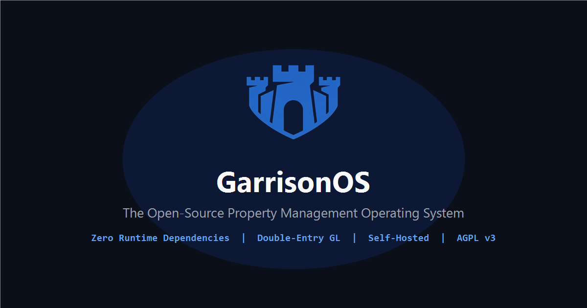

# GarrisonOS

<p align="center">
  <picture>
    <source media="(prefers-color-scheme: dark)" srcset="docs/assets/logo.png">
    
  </picture>
</p>

<p align="center">
  <strong>The Open-Source, Zero-Dependency Property Management Engine</strong>
</p>

<p align="center">
  <em>An open-source, modular, zero-dependency, lightweight property management framework designed to liberate property managers from closed vendor lock-in, inflexible data schemas, and proprietary software silos.</em>
</p>

<p align="center">
  <a href="LICENSE"></a>
  <a href="#pre-production-disclaimer"></a>
  <a href="https://nodejs.org/"></a>
  <a href="https://www.typescriptlang.org/"></a>
  <a href="#dependencies--runtime-prerequisites"></a>
  <a href="#architectural-principles"></a>
  <a href="#automated-test-suite"></a>
  <a href="https://garrisonos.github.io/GarrisonOS/"></a>
</p>

<p align="center">
  
</p>

---

> [!WARNING]
>
> ## Pre-Production Disclaimer
>
> GarrisonOS is currently in **pre-production prototyping** and active development (targeting Foundational MVP Feature-Complete Alpha `v0.1.0-alpha` at Sprint 5). This software is **not ready for production property operations and should not be deployed by end users** until an official stable release is made available. Core APIs, internal schemas, and functionality remain subject to evolution. Developers and contributors are welcome to explore, evaluate, and test the codebase in isolated development environments.

---

## Overview

GarrisonOS is engineered to provide self-managing landlords, independent property managers, and real estate operators with a modern, privacy-respecting, self-hosted property management suite.

The software addresses day-to-day operational tasks, multi-tiered asset hierarchies, leasing workflows, fiduciary client accounting, and structured recordkeeping without recurring subscription fees, vendor lock-in, or opaque data silos imposed by legacy proprietary platforms.

Built from first principles around **zero external runtime dependencies**, GarrisonOS operates entirely as 100% pure TypeScript on standard Node.js runtime libraries, backed by an embedded SQLite engine operating in Write-Ahead Logging (WAL) mode with strict PostgreSQL forward compatibility.

### Key Highlights of Recent Progress

* **Multi-Operator Architecture & 3-Tier Governance**: Cleanly bifurcates software system multi-tenancy (**Operator**) from real-estate rental occupants (**Tenants**), governed by a hierarchical access hierarchy: Platform Master Owner, Platform System Managers, Operator Admins, and Operator Subusers with dual module/portfolio scoping.
* **4-Tier Asset Hierarchy**: Native real estate domain modeling supporting `Portfolios` $\to$ `Properties` $\to$ `Buildings` $\to$ `Units` with unit turnover lifecycle management (`vacant` $\leftrightarrow$ `turnover` $\leftrightarrow$ `maintenance_hold`).
* **Elevated Double-Entry General Ledger & Client Accounting**: Native immutable double-entry bookkeeping (`journal_entries` and `journal_lines`), statutory trust accounting segregation (`1010 Operating` vs. `1020 Trust Checking` / `2100 Tenant Security Deposits Held`), Three-Way Bank Reconciliation, Client Capital Contributions, net cash Client Distributions / Draws, and automated Management Fee calculation and GL accrual.
* **Leasing AR & Fee Policy Engine**: Granular itemized recurring lease charges (pet rent, storage, utilities), configurable late fee policies (flat, % balance, % rent) with statutory caps, lease credits and concessions, and security deposit refunds vs. AR overpayment returns.
* **Universal Document Attachments & Media Safety**: Zero-dependency polymorphic document subsystem supporting file attachments across all core entities, streaming RFC 7578 multipart parsing, automated EXIF stripping for JPEG/PNG, executable script neutralization for PDFs, and per-operator storage quota enforcement.
* **System Administration GUI & Observability**: Dedicated `/admin` control center rendering real-time Node.js process telemetry (CPU, RSS, heap), operator storage quota gauges, rate limiter observability, and dead-letter error logs.
* **Turnkey Production Packaging**: Zero-dependency Alpine Dockerfile, Docker Compose, hardened Systemd service unit, Caddy and Nginx reverse proxy configurations with automatic TLS, and unified `.tar.gz` backup and restore tooling bundling SQLite snapshots and physical media attachments.

---

## Navigation

| Category | Documents |
| :--------- | :---------- |
| **Roadmap** | [Canonical Roadmap](docs/ROADMAP.md) |
| **Architecture** | [Architecture Overview](docs/architecture/overview.md) • [Domain Models DDL](docs/architecture/domain-models.md) • [REST API Specification](docs/architecture/api-spec.md) • [Multi-Tenancy & Operators](docs/architecture/multi-tenancy.md) • [Bootstrap Spec](docs/architecture/bootstrap-spec.md) • [Technical Debt](docs/architecture/technical-debt.md) |
| **Domain Modules** | [Overview](docs/modules/overview.md) • [Properties & Buildings](docs/modules/properties.md) • [Contacts Directory](docs/modules/contacts.md) • [Leasing & AR](docs/modules/leases.md) • [Accounting & Ledger](docs/modules/accounting.md) • [Maintenance & Work Orders](docs/modules/maintenance.md) • [Backup & Disaster Recovery](docs/modules/backup.md) |
| **API & Events** | [REST API Reference](docs/api/rest-api.md) • [EventBus Topics](docs/api/events.md) |
| **Development** | [Getting Started](docs/development/getting-started.md) • [Frontend Guide](docs/development/frontend-guide.md) • [Testing](docs/development/testing.md) • [Tooling](docs/development/tooling.md) • [Engineering Guardrails](AGENTS.md) |
| **Deployment** | [Production Guide & Runbook](docs/deployment/production-guide.md) • [Self-Hosting](docs/deployment/self-hosting.md) • [Configuration](docs/deployment/configuration.md) • [Backup & Maintenance](docs/deployment/backup-and-maintenance.md) |
| **Governance & Legal** | [CLA](docs/legal/CLA.md) • [License](LICENSE) • [Attributions](ATTRIBUTIONS.md) • [Security](SECURITY.md) • [Code of Conduct](CODE_OF_CONDUCT.md) • [Contributing](CONTRIBUTING.md) • [Changelog](CHANGELOG.md) |

---

## Target MVP Scope

The GarrisonOS MVP is focused strictly on delivering a robust, self-hosted property management platform tailored for **small-to-mid residential portfolios (up to 50–100 units)**, including single-family homes, duplexes/fourplexes, scattered-site portfolios, and small-to-mid multifamily communities.

### In Scope for Foundational MVP

* **4-Tier Asset Hierarchy & Turnover Workflows**: Portfolios, physical properties, multi-story buildings, rentable units, vacancy tracking, and unit turnover state machine (`vacant` $\leftrightarrow$ `turnover` $\leftrightarrow$ `maintenance_hold`) with auto-generated make-ready work orders.
* **Contacts Directory & Vendor Compliance**: Centralized human directory (tenants, owners, vendors, emergency contacts, guarantors), vendor trade specializations (plumbing, HVAC, electrical, etc.), visual W-9 verification flags (`w9_received`), and legal tax classification tracking.
* **Leasing Lifecycle & AR Engine**: Draft $\to$ Active $\to$ Expiring $\to$ Renewed $\to$ Terminated state flow, multi-party signatories, renewal modals, move-out termination workflows with statutory deposit countdown timers, itemized recurring lease charges, late fee policy engine, lease credits/concessions, and deposit refund tracking.
* **Elevated Double-Entry General Ledger & Statutory Trust Accounting**: Native, append-only double-entry journal engine (`journal_entries` and `journal_lines`) enforcing balanced zero-sum debit/credit proofs, statutory trust accounting segregation (`1010 Operating Checking` vs. `1020 Trust Checking` / `2100 Tenant Security Deposits Held`), Three-Way Bank Reconciliation schedules, IRS Schedule E tax mapping, Trial Balance verification, Form 1099-NEC vendor aggregation ($600 threshold), and streamed accounting exports (Rent Roll, Schedule E P&L, tenant ledgers, QuickBooks QBO/IIF/OFX).
* **Client Portfolio Accounting & Management Fees**: Capital contributions with automatic GL posting and non-commingling validation, portfolio cash summaries (`?basis=cash|accrual`), client distributions/draws restricted to available operating cash, and management fee agreements with automated calculation (flat per-unit or percentage of collected revenue) and GL accrual posting.
* **Universal Document Attachments & Media Safety**: File attachments across core domain entities, zero-dependency streaming multipart parser, automated EXIF stripping for JPEGs and PNGs, executable script neutralization for PDFs, and per-operator storage quota enforcement.
* **Admin Management GUI & System Observability**: Dedicated `/admin` dashboard displaying real-time Node.js process health (uptime, CPU load, RSS, heap), operator storage quota gauges, rate limiter observability metrics, dead-letter failure queue from `EventBus`, and dynamic module inspection.
* **Backup, Portability & Disaster Recovery**: SQLite online `VACUUM INTO` snapshots with safe WAL checkpointing, unified `.tar.gz` archives bundling the database and physical media attachments with SHA-256 verification, in-process automated `BackupScheduler` daemon with retention pruning, and standalone CLI restore utility (`scripts/restore.js`).
* **Turnkey Deployment**: Zero-dependency Alpine Docker container, Docker Compose, hardened Systemd service unit, Caddy (automatic Let's Encrypt TLS) and Nginx reverse proxy configurations.

---

## Architectural Principles

1. **Zero External Runtime Dependencies**:
   * **Backend Engine**: Built exclusively on native Node.js standard modules (`node:http`, `node:sqlite`, `node:crypto`, `node:zlib`, `node:async_hooks`, `node:events`, `node:fs`, `node:path`, `node:test`, `node:assert`). No external npm packages at runtime (no Express, Fastify, Prisma, TypeORM, Zod, uuid, or bcrypt).
   * **Frontend Presentation**: Built exclusively on native TypeScript SSR with Node.js standard modules, automatic XSS-safe tagged template HTML (`html` in `web/lib/html.ts`), and semantic HTML5 with vanilla CSS Custom Properties. Zero runtime npm dependencies, no PHP, no frontend frameworks, and no client-side bundlers.
2. **Strict Multi-Operator Isolation & 3-Tier Governance**:
   * Every operational database table includes an `operator_id TEXT NOT NULL` column referencing `operators(id)`.
   * Clear domain boundary separating software multi-tenancy (**Operator**) from real-estate rental occupants (**Tenants**).
   * Platform governance model distinguishing Platform Master Owners (`system_owner`), Platform System Managers (`system_manager`), Operator Admins, and Operator Subusers.
   * Granular subuser dual-scoping via `user_portfolio_access` and `user_module_access` junction tables, enforced with privilege ceiling rank guards (`ROLE_RANK`).
   * Operator context is extracted implicitly from session tokens or request headers (`X-Operator-ID`) and propagated down the execution stack using `AsyncLocalStorage`—never accepted from untrusted request bodies or URL parameters.
3. **4-Tier Asset Hierarchy**:
   * Native modeling of real estate assets: `Portfolios` (legal ownership/LLC entities) $\to$ `Properties` (physical addresses) $\to$ `Buildings` (multi-story structures) $\to$ `Units` (rentable inventory).
   * Clean relational integrity with cascading soft deletes and building-to-unit association validation.
4. **Pure Double-Entry General Ledger & Client Accounting**:
   * All currency values are strictly stored and calculated as **INTEGER cents** (e.g., $1,450.00 is stored as `145000`). Floating-point currency math is prohibited.
   * Immutable, append-only bookkeeping engine (`journal_entries` and `journal_lines`) requiring every transaction to satisfy $\sum \text{Debits} \equiv \sum \text{Credits} > 0$. Corrections are posted exclusively via explicit reversal entries with linked `reversed_by_entry_id` references.
   * `lease_id` on journal lines elevates double-entry GL as the primary source of truth for accounts receivable and tenant ledger balances, with progressive sunset of legacy single-entry records.
   * Dedicated client accounting engine for property owner capital contributions, cash distributions, and management fee agreements.
5. **Universal Document Attachments & Media Safety**:
   * Zero-dependency polymorphic document attachments linked across properties, units, leases, work orders, and contacts.
   * In-engine media sanitizer: automated EXIF metadata stripping for JPEGs and PNGs, executable script neutralization for PDFs (`/JavaScript`, `/JS`, `/Launch`, `/EmbeddedFiles`), anti-polyglot file magic byte verification, and strict MIME whitelisting.
   * Bounded streaming RFC 7578 multipart/form-data parser with per-operator storage quota enforcement (`storage_quota_bytes`).
6. **Deterministic Identity & Time Standards**:
   * **Primary Keys**: RFC 9562 **UUIDv7** (time-ordered 128-bit UUIDs generated natively via `node:crypto.randomBytes`).
   * **Timestamps**: Stored strictly as **INTEGER milliseconds** (UTC epoch ms via `Date.now()`).
   * **Soft Deletes**: Standardized `deleted_at INTEGER` timestamp column across all entity tables (`NULL` when active).
7. **PostgreSQL Forward Compatibility & Portable SQL**:
   * While running on embedded SQLite for local zero-dependency operation, all schemas, migrations, queries, and DDL strictly observe cross-dialect ANSI standards (standard quotes, `ON CONFLICT DO UPDATE/NOTHING`, integer timestamps, ANSI partial indexes) for drop-in PostgreSQL compatibility.
8. **Decoupled API-First Architecture & Native TypeScript SSR**:
   * Core Node.js engine exposes a structured HTTP REST API conforming to standardized JSON envelopes (`successResponse` and `errorResponse`).
   * Presentation layer communicates via loopback HTTP requests with cryptographic CSRF token validation and HMAC-SHA256 signed cookie sessions.
9. **Fail-Closed Security & Global Rate Limiting**:
   * All cryptographic, permission, and authentication checks fail closed.
   * Sliding-window rate limiter middleware protects all operational routes, with rate limiting observability and metrics exported to the Admin GUI.

---

## Dependencies & Runtime Prerequisites

GarrisonOS is architected with **zero external runtime package dependencies**.

### Backend Engine

* **Runtime**: [Node.js](https://nodejs.org/) `v22.5.0` or newer (`v24.x LTS` recommended for built-in `node:sqlite` support).
* **Standard Library Modules Utilized**:
  * `node:http`: Low-latency HTTP server, custom streaming JSON parser, and REST router.
  * `node:sqlite`: Synchronous embedded SQLite database engine with WAL mode and transaction wrapper.
  * `node:crypto`: RFC 9562 UUIDv7 generator, `scrypt` password hashing with salt, and HMAC-SHA256 token signing.
  * `node:zlib`: Gzip compression for database snapshots, data exports, and `.tar.gz` backup bundles.
  * `node:async_hooks`: `AsyncLocalStorage` operator and user context store.
  * `node:events`: In-process asynchronous `EventBus` with dead-letter queue.
  * `node:fs` / `node:fs/promises`: Local disk storage driver and dynamic module loader.
  * `node:path`: Filesystem path normalization and traversal prevention.
  * `node:test` & `node:assert`: Native automated test runner and assertion library.
* **Build-Time Development Dependencies** (zero runtime footprint):
  * `typescript` (`^5.8.0`): Static typing and compilation to ES2022 JavaScript.
  * `@types/node` (`^24.0.0`): TypeScript definitions for Node.js standard modules.

### Frontend Presentation Layer

* **Runtime**: [Node.js](https://nodejs.org/) `v22.5.0` or newer (unified with backend engine).
* **Architecture**: Server-Side Rendered (SSR) TypeScript templates with tagged template `html` auto-escaping and HMAC-SHA256 cookie sessions.
* **Standard Library Modules Utilized**: `node:http`, `node:crypto`, `node:fs`, `node:path`.
* **Client-Side Stack**:
  * Semantic HTML5.
  * Vanilla CSS with CSS Custom Properties (supports Light and Dark themes).
  * Minimal progressive enhancement JavaScript (zero client-side build pipeline or npm bundlers required).

### Storage & Database

* **Database Engine**: Embedded SQLite 3 (managed natively via `node:sqlite.DatabaseSync`).
* **Database PRAGMAs**: Write-Ahead Logging (`PRAGMA journal_mode = WAL`), Foreign Key enforcement (`PRAGMA foreign_keys = ON`), Busy Timeout (`PRAGMA busy_timeout = 5000`), Synchronous Normal (`PRAGMA synchronous = NORMAL`).
* **File Attachments**: Local disk storage partitioned by year, month, and UUID under `STORAGE_PATH/attachments`, packaged into `.tar.gz` backup archives.

---

## Target MVP Capabilities


```text
┌────────────────────────────────────────────────────────────────────────────────────────┐
│                                       GarrisonOS                                       │
├──────────────┬──────────────┬──────────────┬─────────────┬─────────────┬───────────────┤
│  Properties  │   Contacts   │    Leases    │ Accounting  │ Maintenance │  Attachments  │
│ & Buildings  │  Directory   │    & AR      │  & Ledger   │ Work Orders │  & Media Docs │
└──────────────┴──────────────┴──────────────┴─────────────┴─────────────┴───────────────┘
```

### 1. Properties, Buildings & Portfolios (`modules/properties`)

* **4-Tier Asset Hierarchy**: Organize real estate assets by Portfolio (LLC / ownership entity) $\to$ Physical Property $\to$ Multi-story Building $\to$ Rentable Unit.
* **Building Lifecycle**: Add, edit, list, and delete multi-story building records with floors, construction year, and address metadata, with atomic decoupling from units on removal.
* **Rentable Unit Inventory**: Track bedroom/bathroom configurations, square footage, market rent, target deposits, and building linkages.
* **Turnover State Machine**: Seamlessly transition units between `vacant` $\leftrightarrow$ `turnover` $\leftrightarrow$ `maintenance_hold`, with automated generation of make-ready work orders.
* **Vacancy & Occupancy Metrics**: Real-time occupancy percentages and portfolio unit status counts.

### 2. Contacts Directory (`modules/contacts`)

* **Unified Human Directory**: Centralized management of tenants, property owners, maintenance vendors, co-signers/guarantors, prospects, and emergency contacts.
* **Vendor Trade Specializations**: Classify contractors across specialized trades (Plumbing, Electrical, HVAC, Appliance, Roofing, Turnover Cleaning, General Repair).
* **Tax Compliance & W-9 Tracking**: Track legal tax classifications (Individual/Sole Proprietor, C-Corp, S-Corp, Partnership, LLC) with visual W-9 verification flags (`w9_received`) and alerts for missing documentation.

### 3. Lease Management & Leasing AR (`modules/leases`)

* **Contract Lifecycle**: `draft` $\rightarrow$ `active` $\rightarrow$ `expiring` $\rightarrow$ `renewed` $\rightarrow$ `terminated` / `month_to_month`.
* **Multi-Party Signatories**: Support Primary Tenants, Co-Tenants, Guarantors, and Occupants with financial responsibility indicators.
* **Interactive Renewal & Move-Out Workflows**: Modal workflows for lease extensions and move-out notices with statutory security deposit deduction countdown timers.
* **Itemized Recurring Charges**: Manage recurring lease add-ons (pet rent, parking spaces, storage lockers, utility rebills) billed idempotently with monthly rent.
* **Late Fee Policy Engine**: Flexible late fee policies (flat fee, percentage of balance, percentage of monthly rent) with configurable grace periods, delinquency thresholds, statutory caps, and automatic GL posting.
* **Credits & Concessions**: Grant promotional discounts and repair credits with automatic GL posting (Dr: Lease Concessions, Cr: Accounts Receivable).
* **Security Deposit Refunds**: Granular refund processing supporting statutory deposit disposition (Dr: Tenant Deposits Held, Cr: Trust Checking) and accounts receivable overpayment returns (Dr: Accounts Receivable, Cr: Operating Checking).

### 4. Native Double-Entry General Ledger & Client Accounting (`modules/accounting`)

* **Immutable Double-Entry Engine**: First-class double-entry journal entries (`journal_entries`) and lines (`journal_lines`) enforcing strict zero-sum debit/credit balance proofs across all operational transactions.
* **Statutory Trust Accounting & Non-Commingling**: Fiduciary segregation between operating funds (`1010 Operating Checking`) and tenant security deposits (`1020 Trust Checking` / `2100 Tenant Security Deposits Held`), preventing unlawful commingling under state real estate licensing statutes.
* **Three-Way Bank Reconciliation**: Automated verification schedules proving parity across all three fiduciary dimensions:
  $$\text{Bank Statement Balance} \equiv \text{GL Trust Account Balance (1020)} \equiv \sum \text{Active Lease Deposit Liabilities}$$
* **Client Portfolio Accounting**: Record property owner capital contributions with trust non-commingling validation, compute portfolio cash summaries (`?basis=cash|accrual`), execute client distributions/draws validated against available operating cash, and calculate/post management fee agreements (flat per-unit or percentage of collected cash revenue).
* **Vendor Tax Compliance (IRS Form 1099-NEC)**: Vendor Tax ID (EIN/SSN) tracking and annual maintenance expense aggregation with automated alerts for vendors meeting or exceeding the statutory $600/year threshold.
* **Trial Balance & Schedule E Reporting**: Live verification report proving $\sum \text{Debits} \equiv \sum \text{Credits}$, with standard Chart of Accounts directly mapped to IRS Form 1040 Schedule E lines.
* **Accounting Data Exports**: Streamed exports for Rent Roll, Schedule E statements, tenant statements, and direct persistent ledger exports for QuickBooks Online (`.csv`), QuickBooks Desktop (`.iif`), and Web Connect bank feeds (`.qbo`).

### 5. Maintenance & Work Orders (`modules/maintenance`)

* **Work Order Lifecycle**: End-to-end tracking (`open`, `assigned`, `in_progress`, `on_hold`, `completed`, `cancelled`).
* **Priority Triage Matrix**: Emergency, High, Medium, and Low triage classifications with trade category assignments.
* **Trade-Filtered Vendor Dispatch**: Dispatch modal matching maintenance tickets to qualified vendors with active W-9 compliance status.
* **Automated Turnover Make-Ready**: Automated generation of turnover work orders when units enter make-ready status.
* **Cost Tracking & Event Bus Conversion**: Track estimated vs. actual repair costs, with automatic creation of accounting expenses upon work order completion via the Event Bus.

### 6. Universal Document Attachments & Media Safety (`modules/attachments`)

* **Polymorphic File Attachments**: Attach documents, photos, and contracts to properties, units, leases, work orders, and contacts.
* **Zero-Dependency Streaming Multipart Parser**: Native RFC 7578 multipart/form-data parser streaming file uploads with bounded memory limits.
* **Zero-Dependency Media Sanitizer**:
  * Strips EXIF metadata from JPEGs (APP1–APP15, COM markers) and PNGs (`eXIf`, `tEXt`, `zTXt`, `iTXt`).
  * Neutralizes executable PDF scripts (`/JavaScript`, `/JS`, `/Launch`, `/EmbeddedFiles`).
  * Enforces anti-polyglot magic byte verification and strict MIME whitelisting.
* **Storage Quota Enforcement**: Operator-isolated storage tracking with HTTP 413 `QUOTA_EXCEEDED` enforcement against configured quotas (`storage_quota_bytes`).

### 7. Admin Management GUI & System Observability (`web/pages/admin.ts`, `/admin`)

* **System Health Telemetry**: Live dashboard displaying Node.js process uptime, CPU load, RSS, and heap memory usage.
* **Operator Quota Consumption Gauges**: Visual progress meters tracking disk storage consumption vs. allocated quota bytes.
* **Rate Limiter Observability**: Real-time metrics on active client windows, tracked keys, and HTTP 429 throttling events.
* **Dead-Letter Failure Queue**: Observability into asynchronous `EventBus` listener exceptions without process termination.
* **Dynamic Module Inspector**: Live inventory of loaded modules, versions, and route registrations.
* **Configurable RBAC & Privilege Ceilings**: Fine-grained permission matching (`resource:action`) with database-backed operator role overrides and privilege ceiling rank guards (`ROLE_RANK`).

### 8. Backup & Disaster Recovery (`modules/backup`)

* **Point-in-Time SQLite Snapshots**: Safe WAL checkpointing and online SQLite `VACUUM INTO` snapshots with gzip compression (`.sqlite.gz`).
* **Unified Media & Database Backup**: Packages the SQLite database snapshot and all physical media attachments from `STORAGE_PATH/attachments` into unified, verified POSIX ustar `.tar.gz` archives.
* **Automated Backup Daemon**: In-process `BackupScheduler` daemon executing automated snapshots, online vacuum/optimize routines, and retention policy pruning.
* **Cryptographic Integrity Hashing**: SHA-256 integrity verification upon archive creation and on-demand restore validation.
* **Standalone CLI Disaster Recovery Tool**: Standalone `node scripts/restore.js <path-to-snapshot>` utility with binary header validation, stale WAL cleanup, and automated migration execution.

### 9. Web Presentation Layer & Executive Dashboard (`web/`)

* **Executive KPI Dashboard**: Real-time portfolio summary cards (occupancy rate %, monthly rent roll total, outstanding delinquency amount, open work order count).
* **First-Launch Setup Wizard**: Choose between **Single-Operator Mode** (dedicated single-company deployment) and **Multi-Operator Mode** (multi-firm platform), defining initial master administrator credentials.
* **Security & Session Hygiene**: Cryptographic CSRF validation on state-modifying requests, timing-safe credential verification, sliding-window rate limiting, and HTTP-only cookie sessions.
* **Responsive UI Design System**: Vanilla CSS design tokens, light/dark theme toggle, native HTML `<dialog>` modals, and accessible ledger tables.

---

## Project Milestones & Roadmap

Implementation planning, sprint tracking, deliverable scorecards, and future roadmap phases are maintained canonically in [docs/ROADMAP.md](docs/ROADMAP.md).

Please refer to the [Canonical Roadmap](docs/ROADMAP.md) for current sprint deliverables, feature completion status, and release milestones.

---

## Directory Structure

```text
garrison-os/
├── .github/
│   └── workflows/
│       ├── ci.yml                     # Automated build and test pipeline
│       ├── cla.yml                    # Automated Contributor License Agreement check
│       └── security.yml               # Automated hygiene and secret scanning
├── .betterleaksignore                 # Secret scanning baseline exception rules
├── .env.example                       # Environment configuration template
├── .gitignore
├── AGENTS.md                          # Mandatory engineering guardrails & rules
├── CONTRIBUTING.md                    # Contribution guide & development standards
├── Dockerfile                         # Multi-stage zero-dependency Alpine container
├── docker-compose.yml                 # Turnkey production container orchestration
├── LICENSE                            # AGPLv3 with Section 7(b) UI attribution addendum
├── package.json                       # Zero runtime dependencies (typescript, @types/node)
├── tsconfig.json                      # Strict TypeScript compiler options
│
├── deploy/                            # Production Deployment Configurations
│   ├── caddy/                         # Automatic Let's Encrypt TLS reverse proxy
│   │   └── Caddyfile
│   ├── nginx/                         # Hardened reverse proxy configuration
│   │   └── nginx.conf
│   └── systemd/                       # Hardened Linux service unit
│       └── garrison.service
│
├── docs/                              # Comprehensive Documentation Hierarchy
│   ├── README.md                      # Documentation navigation index
│   ├── assets/                        # Brand identity, logos, navigation marks, and UI assets
│   ├── ROADMAP.md                     # Canonical roadmap, sprint deliverables & scorecards
│   ├── architecture/                  # Domain models DDL, REST API spec, multi-tenancy & blueprints
│   ├── modules/                       # Module architectural guides
│   ├── api/                           # REST API reference & EventBus catalog
│   ├── development/                   # Getting started, frontend guide & testing standards
│   ├── deployment/                    # Production runbook, self-hosting & WAL maintenance
│   └── legal/                         # Contributor License Agreement (CLA)
│
├── core/                              # Foundation Engine
│   ├── context.ts                     # AsyncLocalStorage operator & user context store
│   ├── crypto.ts                      # RFC 9562 UUIDv7 generator, scrypt hashing, auth tokens
│   ├── events.ts                      # In-process EventBus with dead-letter failure queue
│   ├── rbac.ts                        # Configurable RBAC permission matrix & privilege rank ceiling
│   ├── storage.ts                     # Path-safe local file storage abstraction
│   ├── module-loader.ts               # Dynamic module scanner & registrar
│   └── index.ts
│
├── api/                               # Zero-Dependency HTTP Layer
│   ├── router.ts                      # Native HTTP router (static precedence, regex matching)
│   ├── middleware.ts                  # Operator resolution, auth verification, rate limiting
│   ├── response.ts                    # Standardized JSON response envelopes
│   ├── server.ts                      # Native HTTP server harness & health checks
│   └── index.ts
│
├── database/                          # SQLite Database Layer
│   ├── client.ts                      # node:sqlite client with WAL mode & transactions
│   ├── migrator.ts                    # Native SQL migration runner & _migrations tracker
│   ├── seed.ts                        # Realistic 20-unit sample portfolio seeder
│   └── migrations/                    # Core system migrations
│       ├── 0001_core_schema.sql
│       ├── 0002_add_tenants_view.sql
│       ├── 0003_add_operator_storage_quota.sql
│       ├── 0004_drop_tenants_view.sql
│       ├── 0005_create_role_permissions.sql
│       └── 0006_platform_roles_and_subusers.sql
│
├── modules/                           # Self-Contained Domain Modules
│   ├── properties/                    # Portfolios, Properties, Buildings, Units & test/
│   ├── contacts/                      # Human Directory, Vendors, W-9 Compliance & test/
│   ├── leases/                        # Leases, Signatories, Recurring Charges, Late Fees & test/
│   ├── accounting/                    # GL, Client Accounting, Billing, Schedule E & test/
│   ├── maintenance/                   # Work Orders, Trade Dispatch, Make-Ready & test/
│   ├── attachments/                   # Document & Media Management, Sanitizer & test/
│   └── backup/                        # SQLite Snapshots, Unified Tar Backup & test/
│
├── web/                               # Native TypeScript SSR Presentation Layer
│   ├── server.ts                      # Presentation HTTP server & session manager
│   ├── router.ts                      # Front controller, CSRF validator & dynamic router
│   ├── static.ts                      # Static asset handler with path-traversal guards
│   ├── lib/                           # API client, session auth, CSRF, and UI hooks
│   ├── templates/                     # Base layout, header, dynamic sidebar, flash alerts
│   ├── pages/                         # Dashboard, admin GUI, login, setup wizard & errors
│   └── public/                        # Static brand assets (favicons, logo, OG card), CSS, JS
│
├── scripts/                           # Zero-Dependency Operational & CI Tooling
│   ├── setup.js                       # Automated preflight environment validator & seeder
│   ├── serve.js                       # Unified Node API & Web presentation development runner
│   ├── test.js                        # Dynamic multi-module test runner harness
│   ├── restore.js                     # Disaster recovery & unified snapshot restore utility
│   ├── check-hygiene.js               # Repository compliance & architectural scanner
│   ├── check-security.js              # Security blast radius & fail-closed validator
│   ├── install.sh                     # Verified release installer for Linux / macOS
│   └── install.ps1                    # Verified release installer for Windows PowerShell
│
└── test/                              # Automated Test Suite (node:test & node:assert)
    ├── helpers.ts                     # In-memory SQLite fixtures & mock harnesses
    ├── crypto.test.ts                 # UUIDv7 format, timestamp ordering & scrypt tests
    ├── context.test.ts                # AsyncLocalStorage concurrency & isolation tests
    ├── isolation.test.ts              # Cross-operator data isolation & leak tests
    ├── router.test.ts                 # Route matching, params & body parsing tests
    ├── modules.test.ts                # Dynamic module & test packaging discovery tests
    ├── api/                           # System operator & rate limiting tests
    ├── core/                          # RBAC permission & privilege ceiling tests
    └── e2e/                           # End-to-end operator lifecycle journey tests
```

---

## Getting Started

### 1. Prerequisites

Ensure you have the following installed on your host system:

* **Node.js**: `v22.5.0` or higher (`v24.x LTS` recommended; verify via `node -v`).
* Zero external package dependencies, build tools, or external database engines required.

---

### 2. Quickstart with Docker Compose

For a turnkey deployment using containerization:

```bash
# Clone the repository
git clone https://github.com/garrisonos/GarrisonOS.git
cd GarrisonOS

# Copy environment variables and generate secure APP_SECRET
cp .env.example .env

# Launch via Docker Compose
docker compose up -d
```

Open your browser at **`http://localhost:8080`** to access the setup wizard.

---

### 3. Native Quickstart (Developer Setup)

For local development or running directly on bare metal:

```bash
# 1. Clone the repository
git clone https://github.com/garrisonos/GarrisonOS.git
cd GarrisonOS

# 2. Run automated preflight and setup tool (with realistic demo data):
npm run setup -- --seed
```

*(On Windows PowerShell, use `npm.cmd run setup -- --seed` or `node scripts/setup.js --seed`).*

The setup script automatically validates Node.js prerequisites, generates a secure `.env` file with a cryptographically random `APP_SECRET`, compiles TypeScript, runs SQLite migrations, and seeds a realistic 20-unit demo portfolio.

```bash
# 3. Start the application (API engine and Web presentation layer)
npm start
```

*(On Windows PowerShell, use `npm.cmd start`).*

Once launched, navigate to **`http://localhost:8080`**.

#### First-Launch Setup Wizard

* On fresh installations without `--seed`, GarrisonOS opens the **First-Launch Setup Wizard** (`/setup`), prompting you to choose:
  * **Single-Operator Mode**: Optimized for self-managing landlords and independent property management firms operating a single company.
  * **Multi-Operator Mode**: Configured for multi-firm service bureaus, software operators, and multi-tenant hosting.
* If you seeded the demo portfolio (`--seed`), sign in immediately with:
  * **Email**: `operator@garrisonos.local`
  * **Password**: `Password123!`
  * **Admin Console**: Navigate to `/admin` to inspect system telemetry, operator quotas, and rate limiting status.

---

### 4. Verified Release Installation

Download and verify pre-packaged release archives using cryptographic SHA-256 verification:

#### Linux / macOS (Bash)

```bash
# Download release archive and checksum file
curl -LO https://github.com/garrisonos/GarrisonOS/releases/latest/download/garrisonos.tar.gz
curl -LO https://github.com/garrisonos/GarrisonOS/releases/latest/download/SHA256SUMS

# Verify cryptographic SHA-256 integrity
sha256sum -c --ignore-missing SHA256SUMS

# Extract and run setup
mkdir -p garrison-os && tar -xzf garrisonos.tar.gz -C garrison-os --strip-components=1
cd garrison-os && npm run setup
```

#### Windows (PowerShell)

```powershell
# Download release archive and checksum file
Invoke-WebRequest -Uri "https://github.com/garrisonos/GarrisonOS/releases/latest/download/garrisonos.zip" -OutFile "garrisonos.zip"
Invoke-WebRequest -Uri "https://github.com/garrisonos/GarrisonOS/releases/latest/download/SHA256SUMS.txt" -OutFile "SHA256SUMS.txt"

# Verify cryptographic SHA-256 integrity
$expected = (Get-Content SHA256SUMS.txt -Raw).Split()[0].Trim().ToLower()
$actual = (Get-FileHash -Path garrisonos.zip -Algorithm SHA256).Hash.ToLower()
if ($expected -and ($actual -ne $expected)) { throw "Checksum verification failed!" }

# Extract and run setup
Expand-Archive -Path garrisonos.zip -DestinationPath garrison-os -Force
cd garrison-os; npm.cmd run setup
```

---

## Automated Test Suite

GarrisonOS enforces 100% automated test coverage across core subsystems and domain modules using native `node:test` and `node:assert`:

```bash
# Run full automated test suite (executes all core, module, and E2E test suites)
npm test

# On Windows PowerShell (or directly via node):
npm.cmd test
# or: node scripts/test.js
```

The test runner discovers and executes 40 automated test suites:

* **Core Engine Tests** (`test/`):
  * **Cryptography & Token Security**: RFC 9562 UUIDv7 format, timestamp ordering, `scrypt` hashing, `timingSafeEqual`, and `token_version` revocation.
  * **Context & Isolation**: `AsyncLocalStorage` tenant context propagation, concurrency isolation, and cross-operator leak prevention.
  * **Native HTTP Router**: Static route precedence, parameterized regex matching, streaming request body parser, and error response envelopes.
  * **RBAC & Privilege Ceilings**: Hierarchical wildcard matching, operator role overrides, and `ROLE_RANK` privilege escalation defense.
  * **System APIs**: Operator administration provisioning, storage quota enforcement, and global sliding-window rate limiting.
  * **Module Discovery**: Dynamic manifest scanner, migration sorting, and co-located test suite packaging enforcement.
* **Domain Module Tests** (`modules/[module]/test/`):
  * **Accounting**: Immutable double-entry journal proofs, statutory trust segregation (`1010` vs `1020`), Three-Way Bank Reconciliation, Form 1099-NEC aggregation, Schedule E net operating income calculations, and client accounting (capital contributions, cash distributions, management fees).
  * **Leases**: Contract lifecycle state machine, multi-party signatories, itemized recurring lease charges, late fee policy calculations and GL application, credits/concessions, and security deposit refunds.
  * **Properties**: 4-tier asset hierarchy, building lifecycle CRUD, and unit turnover state machine (`vacant` $\leftrightarrow$ `turnover` $\leftrightarrow$ `maintenance_hold`).
  * **Contacts**: Human directory, vendor trade specializations, and W-9 tax compliance flags.
  * **Maintenance**: Work order lifecycle, priority triage, trade-filtered vendor dispatch, and expense conversion.
  * **Attachments**: Streaming multipart parser, EXIF metadata stripping, executable PDF script neutralization, magic byte validation, and storage quota enforcement.
  * **Backup**: Point-in-time SQLite `VACUUM INTO` snapshots, unified `.tar.gz` archive creation with physical media, integrity validation, and CLI restore recovery.
* **End-to-End Journey Tests** (`test/e2e/lifecycle.test.ts`):
  * Full user journey validating operator onboarding, portfolio/property/building/unit setup, lease execution, fiduciary deposit trust receipt, monthly billing, contractor dispatch, turnover make-ready, and ledger zero-sum balance verification.

---

## Architectural & Security Verification

Before committing changes or creating pull requests, run the project verification tools:

```bash
# 1. Compile TypeScript (must exit 0 with 0 errors)
npm.cmd run build

# 2. Architectural hygiene check (no host path leaks, no prohibited packages)
node scripts/check-hygiene.js

# 3. Security guardrail check (fail-closed installers, parameter validation)
node scripts/check-security.js

# 4. Automated test suite (all suites must pass)
npm.cmd test
```

---

## Contributing

We welcome contributions from the community! Please review our [Contributing Guide](CONTRIBUTING.md), [Code of Conduct](CODE_OF_CONDUCT.md), and [Contributor License Agreement (CLA)](docs/legal/CLA.md) before submitting Pull Requests.

All contributions must adhere to the engineering standards and architectural guardrails specified in [AGENTS.md](AGENTS.md).

---

## Acknowledgements & Attributions

GarrisonOS is built on and inspired by foundational open-source standards, specifications, and regulatory frameworks:

* **Product & Runtime Foundations**: [Node.js](https://nodejs.org/), [TypeScript](https://www.typescriptlang.org/), [SQLite](https://www.sqlite.org/), and [RFC 9562 UUIDv7](https://www.rfc-editor.org/rfc/rfc9562.html).
* **Accounting & Real Estate Standards**: [IRS Form 1040 Schedule E](https://www.irs.gov/forms-pubs/about-schedule-e-form-1040), [IRS Form 1099-NEC](https://www.irs.gov/forms-pubs/about-form-1099-nec), and standard fiduciary trust accounting regulations.
* **Development Tooling & AI Workers**: [LLM Worker Tools](https://github.com/thevahidal/llm-worker-tools), [NVIDIA NIM](https://build.nvidia.com/), [Ollama](https://ollama.com/), [Qwen 2.5 Coder](https://github.com/QwenLM/Qwen2.5-Coder), [Betterleaks](https://github.com/betterleaks/betterleaks), and [markdownlint](https://github.com/DavidAnson/markdownlint).
* **Governance & Community Standards**: [Conventional Commits](https://www.conventionalcommits.org/), [Apache ICLA](https://www.apache.org/licenses/icla.pdf), [Contributor Covenant](https://www.contributor-covenant.org), and [Mozilla D&I](https://github.com/mozilla/diversity).

For complete third-party notices, license texts, and detailed upstream attributions, see [ATTRIBUTIONS.md](ATTRIBUTIONS.md).

---

## Brand Assets & Media Kit

Official GarrisonOS visual identity assets, icons, and logos are located under [`docs/assets/`](docs/assets/) and deployed for web presentation under [`web/public/`](web/public/):

| Asset | Preview | Dimensions & Format | Usage Context | Relative File Path |
| :--- | :---: | :--- | :--- | :--- |
| **Primary Brand Logo** |  | 2420 × 1760 PNG | High-resolution hero branding, splash screens, documentation, and external media | [`docs/assets/logo.png`](docs/assets/logo.png) |
| **Navigation Brand Mark** |  | 111 × 88 PNG | Application sidebar header, top navigation bars, and compact headers | [`docs/assets/logo-nav.png`](docs/assets/logo-nav.png) |
| **OpenGraph Social Banner** |  | 1200 × 630 PNG | Social preview card (Twitter/X, LinkedIn, Discord) and GitHub repository social preview | [`docs/assets/og-image.png`](docs/assets/og-image.png) |
| **Apple Touch Icon** |  | 180 × 180 PNG | High-DPI iOS / iPadOS home screen bookmark icon | [`docs/assets/apple-touch-icon.png`](docs/assets/apple-touch-icon.png) |
| **Favicon (Standard)** |  | 32 × 32 PNG | Standard browser tab icon for modern displays | [`docs/assets/favicon-32x32.png`](docs/assets/favicon-32x32.png) |
| **Favicon (Compact)** |  | 16 × 16 PNG | Compact browser tab icon for standard DPI screens | [`docs/assets/favicon-16x16.png`](docs/assets/favicon-16x16.png) |
| **Multi-Resolution Favicon** |  | 16/32/48 ICO | Legacy root browser shortcut icon served at `/favicon.ico` | [`docs/assets/favicon.ico`](docs/assets/favicon.ico) |

---

## License & Governance

GarrisonOS is licensed under the [GNU Affero General Public License v3 (AGPLv3)](LICENSE) with a Section 7(b) attribution addendum.

Pursuant to Section 7(b), any web-facing or interactive deployment of this software must preserve and prominently display original author attribution and branding ("Powered by GarrisonOS" linking to [https://github.com/garrisonos/GarrisonOS](https://github.com/garrisonos/GarrisonOS)) in the primary application footer or navigation interface.

### Non-Profit Stewardship

GarrisonOS is maintained and governed by the GarrisonOS Foundation (501(c)(3) registration pending), a public-benefit organization dedicated to democratizing property management technology, preventing proprietary vendor lock-in, and providing community, workforce, and affordable housing operators with perpetual open-source data sovereignty.
