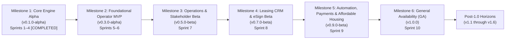
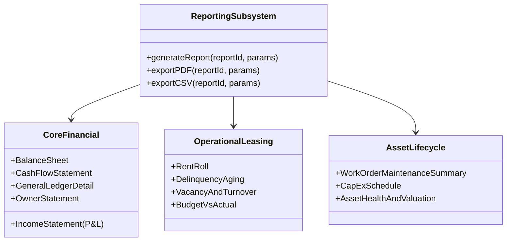

# GarrisonOS Canonical Development Roadmap

This document outlines the canonical development roadmap from Core Engine Alpha through General Availability (**v1.0.0 GA**) and subsequent major releases for **GarrisonOS**. It synthesizes architectural requirements, sprint milestones, competitive analysis of property management systems, clean-room domain specifications, and continuous progress metrics grounded in the [Domain Models Specification](architecture/domain-models.md) and [API Specification](architecture/api-spec.md).

---

## 1. Release Milestone Hierarchy & Operational Definitions

GarrisonOS organizes engineering delivery across six progressive release milestones leading to commercial General Availability, followed by six thematic post-1.0 architectural horizons:

### Milestone 1: Core Engine & Fiduciary Accounting Alpha (`v0.1.0-alpha`) — *COMPLETED*

- **Sprints**: 1–4 (Completed 2026-09-23)
- **Target Audience**: Core developers, architectural auditors, and technical early adopters.
- **Scope Achieved**: Zero-dependency runtime, context propagation, append-only double-entry general ledger, statutory trust accounting (`1010 Operating` vs `1020 Trust Checking` / `2100 Tenant Security Deposits Held`), Three-Way Bank Reconciliation schedules, client portfolio accounting & distributions, universal attachments subsystem with media sanitization, and baseline SSR admin dashboards.

### Milestone 2: Foundational Operator MVP (`v0.3.0-alpha`) — *CURRENT TARGET*

- **Sprints**: 5–6 (Weeks 9–12)
- **Target Audience**: Friendly pilot landlords and independent owner-operators (5–50 residential units).
- **Operational Definition of "MVP"**: A self-contained, offline-capable property management system that an independent operator can use to **run their day-to-day business without paper or spreadsheets**.
- **Core MVP Criteria**:
  1. Complete operational accounting (AP bills, ANSI check printing, bank deposits, bulk ingestion).
  2. **Universal Data Importer** (CSV/Excel import for properties, units, tenants, vendors, and opening balances).
  3. **Core Financial & Operational Reports (Tier 1)**: Interactive & Printable **Rent Roll**, **Income Statement (P&L)** (cash & accrual), **General Ledger Detail Report**, and **Delinquency Aging Report** (30/60/90+ days).
  4. **Field Operations & Responsive UI** (usable on mobile/tablet devices during walk-throughs).
  5. **Field Technician Timecards & Work Order Subtasks** (assigning tasks, tracking hours/costs).
  6. **Physical Access & Pet Management**: Key/fob/lockbox inventory and pet registry with Fair Housing ESA compliance.
  7. **Public Tenant Self-Service Portal** (mobile balance check, repair requests with photo uploads, notification preferences).
  8. **Core Subsystem Polish**: Duplicate invoice detection, internal vs. public notes toggle, in-browser PDF/image preview modal, and regional currency/date locale settings.

### Milestone 3: Field Operations & Stakeholder Portals Beta (`v0.5.0-beta`)

- **Sprint**: 7 (Weeks 13–14)
- **Target Audience**: Third-party property management companies managing client portfolios.
- **Definition of Done**: Complete physical property custody tracking, client investor reporting, and stakeholder portals:
  1. **Property Condition Inspections** (mobile-first room-by-room move-in/move-out condition grading, photo logs, and pre-move-out statutory tenant counter-signing).
  2. **Stakeholder & Asset Reports (Tier 2)**: **Formal Owner Statement** (cash collections, itemized repairs, fees, distributions, reserves), **Balance Sheet**, **Work Order & Maintenance Summary** (costs, vendor spend, MTTR), and **Vacancy & Turnover Report** (economic vs. physical occupancy, loss-to-lease).
  3. **1-Click End-of-Month Owner Settlement & Distribution Run** (automated fee sweep from Trust to Operating, owner draw journal entry, ACH batch generation, and Owner Statement emailing).
  4. **Rentable Physical Assets, Parking & Vehicle Permit Management** (assigned parking stalls, storage lockers, EV charging stations, resident vehicle registrations, guest passes).
  5. **Turnover Automation** (1-click work order and deposit deduction creation from inspection defects).
  6. **Client / Owner Self-Service Portal** (`client.<domain>`, portfolio net cash distributions, capital contribution receipts, monthly statements).
  7. **Vendor Onboarding & Compliance Portal** (self-service contractor registration link for W-9, COI, and trade licenses).
  8. **Maintenance Capital Projects & Budgets** (multi-order renovation projects with GL asset capitalization).
  9. **Tenant Work Order Bill-Back Engine** (1-click tenant charge creation for tenant-caused damages).
  10. **Amenity Reservations & Community Calendar** (facility booking with deposit holds).

### Milestone 4: Leasing CRM, Digital Signing & Banking Beta (`v0.7.0-beta`)

- **Sprint**: 8 (Weeks 15–16)
- **Target Audience**: High-turnover residential operators and multi-family communities.
- **Definition of Done**: Complete pipeline from vacancy marketing to legally executed lease contracts and automated bank clearing:
  1. **Prospects & Lead-to-Lease CRM** (lead capture, campaign attribution, interactive Kanban pipeline).
  2. **Public Listing Showcase & Showing Tour Scheduler** (zero-dependency public listings at `/listings`, self-service showing calendar).
  3. **Rental Applications & Household Grouping** (co-applicants, guarantors, application fee recording in GL).
  4. **Landlord Rental History Verification Workflow** (one-time token response links via notification dispatcher).
  5. **Statutory Legal Notices & Eviction Cure Tracking** (court-ready Pay-or-Quit notices with proof-of-service affidavits).
  6. **Lease Document Template Merge Engine** (dynamic merge tags `{{tenant}}`, `{{rent}}`, generating customized PDF contracts).
  7. **Native Cryptographic eSignature Subsystem** (built-in digital signature capture canvas, SHA-256 document hashing, audit certificates, and dual-party execution).
  8. **Statutory Security Deposit Interest Calculator** (jurisdiction-specific annual interest escrow calculations and credits).
  9. **Utility Transfer & Tenant Move-In Activation Checklist** (mandatory account number and utility verification upload before key release).
  10. **Direct OFX / QBO Bank Statement Import** (zero-dependency parser with description auto-matching rules).
  11. **Dual-Engine Architecture (Native PostgreSQL Driver Adapter)** (validated multi-operator central server deployment).
  12. **Financial & Acquisition Reports (Tier 3)**: **Statement of Cash Flows** (operating, investing, financing activities), **1-Click IRS Schedule E Tax Report**, and **Lead Conversion & Velocity Report**.

### Milestone 5: Enterprise Automation, Electronic Payments & Affordable Housing Beta (`v0.9.0-beta`)

- **Sprint**: 9 (Weeks 17–18)
- **Target Audience**: Scaled residential property management firms, multi-family communities, and affordable housing operators.
- **Definition of Done**: Complete native electronic payment rails, high-efficiency rule execution, consolidated communications, and affordable housing compliance:
  1. **Integrated Electronic Payments & Autopay Rails** (zero-fee native NACHA ACH debit & credit batch generator for tenant autopay, owner draw distributions, and vendor AP direct deposits, payment vault, and webhook clearing).
  2. **Affordable Housing & Section 8 (HUD) Vouchers Subsystem** (dual-payer tenant vs. housing authority ledgers, HAP contracts, utility allowances, and annual HUD HQS inspection tracking).
  3. **Declarative Event Automation Engine** (`core/automation-engine.ts`, customizable triggers for rent reminders, move-out workflows).
  4. **Hybrid Submetered Utility & RUBS Billing Engine** (direct submetering, RUBS allocation by sqft/occupants, common-area delta allocation, and leak anomaly detection).
  5. **Enterprise & Lifecycle Reports (Tier 4)**: **Budget-vs-Actual Variance Report** (operational budgets with dollar/% variance), **CapEx Schedule & Fixed Asset Register** (depreciation, replacement forecast, cost basis), and **Section 8 Voucher HAP Summary Report**.
  6. **Batched Monthly Financial Reporting Packages**: 1-click or scheduled generation bundling Owner Statement + P&L + Balance Sheet + Rent Roll into a single downloadable PDF package per owner.
  7. **Returned Payment (NSF) Automated Reversal Workflow** (reversal journals, AR restoration, fee charges).
  8. **Tiered Bill Approval Policies** (spend thresholds requiring manager/owner approval).
  9. **Unified Communications Inbox** (`/inbox`, consolidating email, SMS, and notes).
  10. **Tenant Renters Insurance Compliance & Lapsed Policy Auto-Waiver Fee**.

### Milestone 6: General Availability (GA), Packaging & Plugin Foundation (`v1.0.0`)

- **Sprint**: 10 (Weeks 19–20)
- **Target Audience**: General public, open-source community, and turnkey enterprise customers.
- **Definition of Done**: Commercial-grade installation, automated maintenance network, and extensible plugin architecture:
  1. **Turnkey Click-Through Packaged GUI Installers** (Windows `.exe`/`.msi` via NSIS, macOS `.pkg`/`.dmg`, Linux `.deb`).
  2. **GarrisonOS Managed Update Network & Background Maintenance Subsystem**:
     - Consensual, opt-in automated maintenance channel delivering hands-free security patches, automatic database migration rollbacks, and release delivery.
     - Transparent operational telemetry heartbeat: registered business name, contact email, active unit count, system health, and origin IP address.
     - Air-gapped and manual self-management mode fully preserved with zero feature degradation.
  3. **Modular Plugin Ecosystem Architecture Foundation** (`plugins/` directory, manifest contract, sandbox isolation, and `/admin` registry).
  4. **Pre-Release Security Audit & Release Tag**: Full penetration scan, clean dependency check, final documentation synchronization.

---

## 2. Post-1.0 Architectural Horizons (Plugins & Specialized Domains)

All external third-party integration plugins, non-residential commercial features, and specialized operations are cleanly categorized into six post-1.0 release horizons:

### Horizon A: External Growth, Syndication & Communications Plugins (`v1.1.0`)

- **Dedicated Rental Listing Syndication Plugins (Platform-Specific Adapters)**:
  - **`plugin-syndication-zillow`**: Direct API integration with Zillow Rental Network (Zillow, Trulia, HotPads) with granular listing toggles and lead delivery webhooks.
  - **`plugin-syndication-apartments`**: MITS 4.1 / RESO XML feed integration for CoStar Group network (Apartments.com, ForRent.com, ApartmentFinder).
  - **`plugin-syndication-realtor`**: Automated listing export feed for Realtor.com and Move.com.
- **`plugin-telephony` (Two-Way SMS & Call Hub)**:
  - Twilio and Telnyx webhook integration bringing SMS messaging and call forwarding directly into the Unified Inbox.
- **`plugin-lead-chatbot` (24/7 Leasing AI Web Widget)**:
  - Lightweight, privacy-first prospect inquiry chat widget on `/listings` answering questions from property specs and booking showing appointments.
- **`plugin-community-board` (Moderated Resident Community Bulletin)**:
  - Moderated resident forum on the Resident Portal for classifieds, recommendations, lost items, and community announcements with staff moderation tools.
- **`plugin-lost-and-found` (Physical Asset Custody & Lost Property Log)**:
  - Photo intake registry of items found in amenities (gyms, pools, clubhouses) with resident claim verification and custody release sign-offs.
- **`plugin-resident-rewards` (Curated Local Merchant Perks Directory)**:
  - Curated neighborhood merchant perks and exclusive discount directory on the Resident Portal supporting local small business partnerships.
- **Resident Portal Multi-Language Localization (i18n)**:
  - Translation bundles for the Resident Portal supporting Spanish, French, Mandarin, and Vietnamese.

### Horizon B: Automated Banking, Media Storage & Property Logistics (`v1.2.0`)

- **`plugin-bank-feed` (Automated Direct Bank Transaction Sync)**:
  - Financial aggregator integration (Plaid, Teller, MX) streaming daily posted bank transactions into the GarrisonOS clearing queue for 1-click three-way reconciliation matching.
- **`plugin-s3-media-storage` (S3 / Cloudflare R2 / MinIO Object Storage Adapter)**:
  - External object storage connector offloading high-resolution move-in/move-out inspection photo archives and lease PDF attachments to S3-compatible endpoints.
- **`plugin-calendar-sync` (iCal / CalDAV External Calendar Synchronization)**:
  - Bi-directional calendar feeds synchronizing property showings, inspection dates, and contractor appointments to Google Calendar, Apple Calendar, and Outlook.
- **`plugin-package-locker` (Mailroom & Smart Package Logging)**:
  - Mailroom logging for multi-family communities: carrier barcode scan, unit assignment, automated SMS/email notification with single-use pickup claim codes, and resident sign-out logs.
- **`plugin-utility-scrape` (Automated Master Utility Ingestion & AP Auto-Creation)**:
  - Headless connector logging into municipal utility provider portals (ConEd, Duke Energy, PG&E), downloading billing PDFs, and automatically staging balanced AP bills.
- **`plugin-legacy-migration` (Deep Relational Database ETL Migration Adapter)**:
  - Deep database ETL migration tool extracting full historical general ledgers, tenant transaction tables, vendor 1099 histories, and property hierarchies from AppFolio, Yardi Voyager, and RealPage backups.
- **Central Maintenance Shop Parts & Tool Inventory**:
  - Stock level tracking for supply closets (smoke detectors, HVAC filters, plumbing parts), minimum reorder thresholds, and direct consumption attribution to work orders.

### Horizon C: Resident Screening, Compliance & Financial Intelligence (`v1.3.0`)

- **`plugin-screening` (FCRA Tenant Background & Credit Checks)**:
  - Pluggable connector to TransUnion SmartMove and RentPrep for credit scores, criminal records, and eviction filings.
- **`plugin-credit-reporting` (On-Time Tenant Rent Credit Reporting)**:
  - Metro 2 standard format export reporting on-time tenant rent payments to Experian RentBureau, TransUnion, and Equifax for resident credit building.
- **`plugin-insurance-verification` (Real-Time Carrier Policy Status Verification)**:
  - API integration with major insurance carriers and aggregators (Assurant, Lemonade, State Farm) to verify active coverage and detect mid-lease cancellations.
- **`plugin-pet-dna` (Pet Waste Enforcement & DNA Registry)**:
  - Pet DNA sample tracking linked to commercial lab services (PooPrints) with 1-click violation notice generation and automated fine billing.
- **`plugin-quickbooks-sync` (Two-Way Accounting Export & Synchronization)**:
  - Automated sync connector pushing General Ledger journals, bills, and payments directly into external QuickBooks Online and QuickBooks Desktop company files.
- **`plugin-multi-currency` (International Investor FX & Wire Settlement)**:
  - Daily interbank FX conversion, SWIFT/SEPA international wire batch export, and multi-currency Owner Statements for foreign investors.

### Horizon D: Commercial Real Estate (CRE) & Association Management (`v1.4.0`)

- **`plugin-commercial-cre` (Commercial Triple Net / CAM Reconciliations)**:
  - Triple Net (NNN) commercial lease clauses, Common Area Maintenance (CAM) expense pools, pro-rata square-footage allocations, annual true-up reconciliation workbooks, and CPI-indexed lease escalations.
- **HOA & Condo Association Management Subsystem**:
  - CC&R rule violation tracking (warning letters, violation photos, fine schedules), Architectural Review Committee (ARC) requests, and annual dues assessments.
- **`plugin-vendor-rfq` (Contractor Competitive Bidding & Procurement Marketplace)**:
  - Competitive bidding workflows: publishing repair specifications to a vendor portal, collecting sealed quotes, side-by-side bid comparisons, and 1-click contractor awarding.

### Horizon E: AI Intelligence & Advanced Operations (`v1.5.0`)

- **`plugin-ai-copilot` (Invoice OCR & AI Assistant)**:
  - Pluggable connector for local Ollama (`qwen2.5-coder`, `llama3.2-vision`) and cloud LLMs for automated invoice OCR data extraction and notice drafting.
- **`plugin-ai-emergency-triage` (After-Hours Maintenance Voice & Text Bot)**:
  - Offline-capable local LLM agent performing after-hours emergency triage, providing tenants with immediate safety instructions (e.g. water main shutoff steps) and auto-dispatching on-call contractors.
- **`plugin-virtual-staging` (AI Vacancy Photo Staging & Floor Plan Enhancement)**:
  - Vision AI connector to virtually furnish empty room photos with contemporary furniture and generate clean 2D/3D architectural floor plans for listing syndication.
- **`plugin-esignature-enterprise` (DocuSign / Adobe Sign Adapter)**:
  - Optional third-party e-signature connector for enterprise clients requiring corporate DocuSign accounts.

### Horizon F: Smart Building IoT, Energy & Institutional Asset Planning (`v1.6.0`)

- **`plugin-smart-lock-hub` (IoT Smart Lock & Self-Guided Showing Integration)**:
  - Integration with smart lock hardware (Yale, Schlage, Rently) for unattended prospect showings and automated temporary contractor access codes.
- **`plugin-intercom-access` (Smart Video Intercom & Gate Directory Sync)**:
  - Integration with ButterflyMX, Swiftlane, and Latch for automated tenant directory provisioning on move-in/out and digital guest pass generation.
- **`plugin-smart-water-leak` (IoT Water Leak Detection & Auto-Shutoff Valve Integration)**:
  - Integrates with IoT water leak sensors (Flo by Moen, YoLink, Phyn) to spawn emergency work orders, alert on-call technicians via SMS, and trigger motorized main shutoff valves to prevent catastrophic flood damage.
- **`plugin-electronic-keybox` (Commercial Key Tracker Hardware Integration)**:
  - Integration with commercial electronic key cabinets (HandyTrac, KeyWatcher, Supra) for master key checkout logs, audit trails, and overdue checkout alerts.
- **`plugin-energy-benchmarking` (EPA Energy Star & Municipal ESG Reporting)**:
  - Aggregates utility data into building efficiency metrics (EUI, carbon intensity) and exports to EPA Energy Star Portfolio Manager for municipal compliance (e.g. NYC LL97).
- **30-Year Capital Reserve Study & Replacement Modeling**:
  - Institutional engineering reserve study forecasting for multi-family and commercial roofs, structural elements, elevators, and parking lots.

---

## 3. Resolving the Property & Asset Management Reporting Shortfall

A standard property management platform must provide twelve mission-critical reports spanning financial performance, operational health, and physical asset lifecycles:

### The Canonical 12 Reports Specification

| Report Name | Domain | Primary Purpose & Contents | Required Parameters | Target Sprint |
| :--- | :---: | :--- | :--- | :---: |
| **1. Income Statement (P&L)** | Core Financial | Revenues, operating expenses (Schedule E), and Net Operating Income (NOI). Supports cash vs. accrual basis and monthly comparative columns. | `start_date`, `end_date`, `portfolio_id`/`property_id`, `basis` (`cash`\|`accrual`) | **Sprint 6 (MVP)** |
| **2. Balance Sheet** | Core Financial | Snapshot of total Assets (Operating Cash, Trust Cash, AR), Liabilities (AP, Security Deposits Held), and Equity (Capital, Draws, Retained Earnings). | `as_of_date`, `portfolio_id`/`property_id` | **Sprint 7 (Beta)** |
| **3. Statement of Cash Flows** | Core Financial | Reconciles beginning and ending cash across Operating, Investing, and Financing activities. | `start_date`, `end_date`, `portfolio_id`/`property_id` | **Sprint 8 (Beta)** |
| **4. General Ledger Detail** | Core Financial | Chronological transaction log per account with beginning balance, itemized journal lines (date, source, ref, memo), and ending balance. | `start_date`, `end_date`, `account_id`, `property_id` | **Sprint 6 (MVP)** |
| **5. Owner Statement** | Core Financial | Investor/owner summary: collected income, itemized vendor expenses, management fees, client distribution draws, and ending reserve. | `start_date`, `end_date`, `client_contact_id`, `portfolio_id` | **Sprint 7 (Beta)** |
| **6. Rent Roll** | Operational | Interactive & printable inventory: unit #, bed/bath, sqft, tenant name(s), lease start/end, market rent, contract rent, deposit held, balance. | `as_of_date`, `property_id`/`portfolio_id`, `status` | **Sprint 6 (MVP)** |
| **7. Delinquency Aging** | Operational | Past-due tenant receivables categorized into aging buckets (Current, 1–30, 31–60, 61–90, 90+ days) with tenant phone/email. | `as_of_date`, `property_id`/`portfolio_id` | **Sprint 6 (MVP)** |
| **8. Vacancy & Turnover** | Operational | Vacant units list, days on market, make-ready duration, loss-to-lease, and physical vs. economic occupancy rates. | `start_date`, `end_date`, `portfolio_id`/`property_id` | **Sprint 7 (Beta)** |
| **9. Budget vs. Actual** | Operational | Compares budgeted operational figures against actual general ledger income/expenses with dollar and percentage variance columns. | `fiscal_year`, `period`, `property_id` | **Sprint 9 (Beta)** |
| **10. Work Order Summary** | Asset Lifecycle | Maintenance activity rollup: open/closed count by priority, trade spend breakdown, technician labor hours, and MTTR (mean time to repair). | `start_date`, `end_date`, `property_id`/`vendor_id` | **Sprint 7 (Beta)** |
| **11. CapEx Schedule** | Asset Lifecycle | Multi-year infrastructure forecasting, major repairs, capitalized asset improvements, and scheduled replacements (roof, HVAC, appliances). | `portfolio_id`/`property_id`, `horizon_years` | **Sprint 9 (Beta)** |
| **12. Fixed Asset & Valuation** | Asset Lifecycle | Property purchase cost basis, land/building split, accumulated depreciation, CapEx additions, estimated valuation, and LTV ratio. | `as_of_date`, `property_id` | **Sprint 9 (Beta)** |

---

## 4. Sequentially Numbered Canonical Task Execution Schedule

### Sprint 1 through Sprint 4 (Milestone 1 Core Alpha Delivered)

- **Sprint 1 (Weeks 1–2)**: Core Foundation & Architecture Hardening (AsyncLocalStorage context, migration topological sorting, token versioning, CORS origin restriction, statutory trust accounting, automated backup scheduler daemon, and pure TypeScript SSR rebase).
- **Sprint 2 (Weeks 3–4)**: Production Readiness & Interactive Workflows (Turnkey Dockerfile and Systemd unit, turnover state machine, lease renewal/termination modals, vendor trade specializations, W-9 tracking, router static precedence, and E2E lifecycle test suite).
- **Sprint 3 (Weeks 5–6)**: System Governance, Universal Attachments & Backup Integration (Operator lifecycle administration API, storage quota governance, sliding-window rate limiting, `/admin` management GUI, configurable RBAC, universal attachments with EXIF/PDF sanitization, 3-tier governance model, 4-tier asset hierarchy, and granular subuser dual-scoping).
- **Sprint 4 (Weeks 7–8)**: Financial Modernization, Client Accounting & Policy Engine (Single-entry `transactions` deprecation, client portfolio accounting, capital contributions, client distribution draws, automated management fees, recurring lease charges, late fee policies, Universal Conversations & notes, configurable operator branding, and zero-dependency notification dispatcher).

---

### Sprint 5 (Weeks 9–10): Foundational Operations & Accounts Payable

> **Status**: In Progress | **Target**: v0.2.0-alpha

#### Completed Deliverables (Sprints 1–5 Context)

- [x] **Task 28**: Accounts Payable (AP) Core Subsystem (Bills, Allocations, Recurring Bills).
- [x] **Task 29**: Vendor Credit Memos & Bill Offsets.
- [x] **Task 30**: Zero-Dependency PDF Vendor Check Printing & Check Register.
- [x] **Task 31**: Bank Deposits & Batched Clearing for 3-Way Reconciliation.
- [x] **Task 32**: Amenities Catalog & Marketing Syndication Profiles (`/api/v1/amenities`).
- [x] **Task 33**: Dynamic Custom Fields Engine (`custom_field_definitions`).
- [x] **Task 35**: AP, Banking, Custom Fields & Marketing SSR UI Views.
- [x] **Task 35b**: Universal Entity Preview, Search & Navigation (`/search`, `Ctrl+K`).
- [x] **Task 35c**: Operator User Management, Permissions & Activity Audit (`audit_logs`).

#### Pending Deliverables Closing Sprint 5

- [ ] **Task 34**: Standardized Bulk Ingestion & Temporal Query Conventions
  - **Subtask 34.1**: Implement transactional bulk creation (`POST /api/v1/:resource/bulk`) wrapping insertions in atomic `withTransaction()` blocks.
  - **Subtask 34.2**: Implement standardized millisecond interval filtering (`*_start`, `*_end`) across all entity collection endpoints.
  - **Subtask 34.3**: Implement multi-key sort parsing (`order_by=field:asc,field2:desc`) with strict column whitelist guards preventing SQL injection.
- [ ] **Task 36**: Public-Facing Tenant Self-Service Portal (Subdomain Architecture)
  - **Subtask 36.1**: Implement host-header subdomain routing dispatching `portal.<domain>` requests to isolated portal controllers.
  - **Subtask 36.2**: Implement passwordless magic-link authentication via time-limited HMAC tokens dispatched via SMTP/webhook.
  - **Subtask 36.3**: Implement mobile-first tenant dashboard showing current ledger balance and itemized monthly charges.
  - **Subtask 36.4**: Implement safe mobile maintenance request form with image/photo capture, MIME verification, and EXIF stripping.
  - **Subtask 36.5**: Build Resident Maintenance Self-Help Troubleshooting Wizard displaying illustrated 2-step diagnostic guides (garbage disposal reset, bathroom GFCI outlet reset, breaker check) on maintenance request forms to filter user-resolvable defects before ticket submission.

---

### Sprint 6 (Weeks 11–12): Field Operations, Responsive UI, Data Importer & Core Reports

> **Status**: Planned | **Target**: v0.3.0-alpha (**Foundational Operator MVP Achieved**)

- [ ] **Task 37**: Universal Self-Service Data Migration Importer (`modules/importer`)
  - **Subtask 37.1**: Build pre-import dry-run validation engine parsing CSV/Excel payloads, flagging missing foreign keys, malformed emails, and invalid formats before database mutation.
  - **Subtask 37.2**: Build entity ingestion mappers for Properties, Units, Leases, Tenants, and Vendors supporting column header mapping presets for Buildium, AppFolio, and generic Excel sheets.
  - **Subtask 37.3**: Build opening balance journal importer posting balanced historical General Ledger entries (Dr AR/Bank, Cr Retained Earnings/Prepayments) with zero-sum verification.
- [ ] **Task 38**: Core Reporting Engine & Foundational Reports (Tier 1)
  - **Subtask 38.1**: Build interactive and printable **Rent Roll** (HTML/PDF/CSV) detailing units, lease terms, market vs. contract rent, deposits held, and tenant receivable balances.
  - **Subtask 38.2**: Build **Income Statement (P&L)** engine aggregating operating revenue and Schedule E expenses into Net Operating Income (NOI) with cash vs. accrual toggle and monthly comparison columns.
  - **Subtask 38.3**: Build **General Ledger Detail Report** rendering chronological transaction ledgers per account with opening balances, transaction rows, and running balance proofs.
  - **Subtask 38.4**: Build **Delinquency Aging Report** grouping tenant receivables into Current, 1–30, 31–60, 61–90, and 90+ day aging buckets with direct phone/email contact links.
- [ ] **Task 39**: UI/UX Modernization & Responsive Layout Refinement
  - **Subtask 39.1**: Implement mobile/tablet responsive layout tokens for dense data tables, featuring horizontal scroll containment and automatic card view fallbacks on viewports under 768px.
  - **Subtask 39.2**: Implement sticky table headers, bottom summary action bars, accessible dialog focus trapping, and progressive enhancement states.
- [ ] **Task 40**: Client-Side Form Ergonomics & Interaction Polish
  - **Subtask 40.1**: Implement optimistic UI feedback on button submissions and inline validation styling for form inputs (`:user-valid`, `:user-invalid`).
  - **Subtask 40.2**: Implement zero-dependency native datepicker and currency input formatting masks (`$0.00`) maintaining integer-cents under the hood.
- [ ] **Task 41**: Work Order Subtasks, Task Delegations & Checklists
  - **Subtask 41.1**: Create `work_order_tasks` database table, foreign key relations to `work_orders`, and REST endpoints (`/api/v1/maintenance/work-orders/:id/tasks`).
  - **Subtask 41.2**: Implement technician task assignment, task-level checklist comments, and formal work order completion verification contract.
- [ ] **Task 42**: Field Technician Timecards & Labor Tracking
  - **Subtask 42.1**: Create `technician_timecards` database schema recording technician ID, work order ID, start/end millisecond timestamps, hourly labor rate cents, and billable surcharge calculations.
  - **Subtask 42.2**: Build technician clock-in/out and manual timecard entry SSR UI, automatically generating corresponding Accounts Payable bill allocations.
- [ ] **Task 43**: Unit Turnover Checklist Templates & Make-Ready Dependency Gantt
  - **Subtask 43.1**: Create turnover checklist template definitions schema (`turnover_templates`, `turnover_template_items`) and link them to unit turnover state transitions (`vacant` $\leftrightarrow$ `turnover`).
  - **Subtask 43.2**: Build turnover management screen rendering interactive step-by-step make-ready task lists (cleaning, rekeying, repairs) with sign-off audits.
  - **Subtask 43.3**: Build Multi-Stage Make-Ready Trade Dependency Chain and visual Gantt schedule (`trash_out` $\to$ `maintenance_punch` $\to$ `paint` $\to$ `flooring` $\to$ `deep_clean` $\to$ `final_inspection`) with automated contractor stage-ready notifications and estimated-vs-actual turnover velocity metrics.
- [ ] **Task 44**: Access Inventory, Pet Registry, TCPA Preferences & Locales
  - **Subtask 44.1**: Build Key, Fob & Lockbox Access Inventory tracking master keys, deadbolt codes, gate fobs, and contractor lockbox codes with sign-out logs and move-out return verification.
  - **Subtask 44.2**: Build Pet Registry & Fair Housing ESA Compliance Subsystem recording pet breed, weight, photo, rabies vaccination expiration, and legal Service Animal / ESA fee-exempt documentation.
  - **Subtask 44.3**: Build Resident Communication Preferences & TCPA Opt-In/Opt-Out Registry allowing residents to configure SMS vs. Email for rent receipts, maintenance, and community updates with mandatory emergency override.
  - **Subtask 44.4**: Implement Accounts Payable duplicate invoice number detection warning operators when `vendor_id` + `invoice_number` matches an existing bill.
  - **Subtask 44.5**: Add `is_private` boolean to universal `notes` and `conversations`, allowing staff to record internal comments hidden from the tenant portal.
  - **Subtask 44.6**: Build in-browser document preview modal enabling inline viewing of uploaded PDF agreements and images without forcing file downloads.
  - **Subtask 44.7**: Build multi-photo marketing gallery for properties and units with drag-and-drop ordering, photo captions, and floor plan attachments.
  - **Subtask 44.8**: Implement configurable Operator Regional Locales in `/admin` supporting currency selection (`USD`, `CAD`, `GBP`, `EUR`, `AUD`) and date display formatting (`YYYY-MM-DD`, `MM/DD/YYYY`, `DD/MM/YYYY`).
  - **Subtask 44.9**: Build Digital Property Handbook & Tenant Move-In Onboarding Guide providing a dynamic property rulebook (parking rules, trash/recycling days, emergency water/gas shutoff locations, quiet hours) with mandatory digital acknowledgment on the Resident Portal.

---

### Sprint 7 (Weeks 13–14): Property Condition Inspections, Operations, Stakeholder Portals & Asset Reports

> **Status**: Planned | **Target**: v0.5.0-beta

- [ ] **Task 45**: Property Condition Inspections & Pre-Move-Out Tenant Sign-Off (`modules/inspections`)
  - **Subtask 45.1**: Create clean-room inspection database hierarchy (`inspections`, `inspection_areas`, `inspection_items`) with standardized condition grading (`clean`, `good`, `fair`, `poor`, `damaged`).
  - **Subtask 45.2**: Build mobile-first walk-through inspection interface optimized for tablet/phone touch viewports with quick-tap condition buttons and direct camera photo uploads.
  - **Subtask 45.3**: Build Pre-Move-Out Statutory Inspection workflow allowing tenants to request preliminary walk-throughs and digitally counter-sign reports with dispute notes via the Resident Portal.
  - **Subtask 45.4**: Build automated turnover integration generating make-ready work orders and tenant security deposit deduction items directly from inspection damage flags.
  - **Subtask 45.5**: Build Tenant Security Deposit Disposition & Move-Out Accounting Wizard linking inspection damage items, unpaid rent, late fees, and final utility bills into an automated ledger deduction, computing statutory interest if applicable, cutting refund check/ACH to tenant's forwarding address, and compiling the legal "Itemized Disposition of Deposit" PDF with attached repair receipts within statutory deadline windows.
  - **Subtask 45.6**: Build Move-In/Move-Out Utility Meter Photographic Reading Log prompting inspectors during walk-throughs to capture photographs and exact numeric readings for electric, gas, and water meters, establishing definitive cutoff baselines for tenant billing.
- [ ] **Task 46**: Client / Owner Self-Service Portal (`web/client-portal/`)
  - **Subtask 46.1**: Implement `client.<domain>` subdomain routing, session authentication, and portfolio-level client access scoping.
  - **Subtask 46.2**: Build client owner dashboard rendering portfolio net cash flow, distribution draw history, and capital contribution receipts.
  - **Subtask 46.3**: Build owner document vault providing download access to monthly financial statements and repair work order transparency logs.
- [ ] **Task 47**: 1-Click End-of-Month Owner Settlement & Distribution Run (`modules/accounting`)
  - **Subtask 47.1**: Build End-of-Month Settlement Wizard calculating earned management fees and executing automated funds transfer from Trust (`#1020`) to Operating (`#1010`).
  - **Subtask 47.2**: Calculate owner net operating cash distributions taking minimum property reserve requirements into account, generating balanced draw journal entries.
  - **Subtask 47.3**: Prepare batched NACHA ACH payment export or printable check register records for owner distributions.
  - **Subtask 47.4**: Automatically compile and email bundled Owner Statement PDF packets directly to property owners upon distribution execution.
- [ ] **Task 48**: Stakeholder & Operational Reports (Tier 2)
  - **Subtask 48.1**: Build formal **Property Owner Statement** package detailing opening cash reserves, collected rental income, itemized vendor expenses, management fees deducted, client distribution draws, and ending reserve balances.
  - **Subtask 48.2**: Build **Balance Sheet Report** capturing a point-in-time snapshot of Assets (Cash, Trust Funds, AR), Liabilities (AP, Tenant Security Deposits Held), and Equity (Owner Capital, Owner Draws, Retained Earnings).
  - **Subtask 48.3**: Build **Work Order & Maintenance Summary Report** aggregating work order volume, labor vs. material costs, vendor spend distribution, and Mean Time to Repair (MTTR).
  - **Subtask 48.4**: Build **Vacancy & Turnover Report** detailing vacant units, days on market, make-ready duration, loss-to-lease calculations, and economic vs. physical occupancy rates.
- [ ] **Task 49**: Maintenance Capital Projects & Capitalized Asset Budgets (`modules/maintenance/projects`)
  - **Subtask 49.1**: Create capital projects schema (`maintenance_projects`) allowing grouping of multiple work orders and contractor bills under major capital initiatives (e.g. Roof Replacement).
  - **Subtask 49.2**: Implement capital project budget tracking against actual costs and General Ledger asset capitalization mapping (`#1500 Capital Improvements`).
  - **Subtask 49.3**: Build Automated Preventative Maintenance & Equipment Asset Servicing Engine maintaining an equipment asset registry linked to units and common areas (make, model, serial #, install date, warranty expiration) and recurring servicing schedules (quarterly, semi-annual, annual) automatically spawning pre-assigned work orders before seasonal changes.
  - **Subtask 49.4**: Build Mechanic's Lien Waiver Subsystem for Major CapEx Projects generating statutory Conditional & Unconditional Progress and Final Lien Waivers, restricting final AP payment release until signed by primary contractors.
  - **Subtask 49.5**: Build Fire & Life Safety Annual Compliance Register tracking smoke/CO alarms, fire extinguisher annual tags, emergency lighting tests, and backflow valve certifications per building with inspection reminder alerts.
- [ ] **Task 50**: Tenant Maintenance Bill-Back Engine
  - **Subtask 50.1**: Build 1-click tenant chargeback workflow on work orders, validating tenant-responsibility flags and generating linked AR lease charges.
  - **Subtask 50.2**: Implement tenant bill-back invoice delivery via notification dispatcher with itemized vendor receipt attachments.
- [ ] **Task 51**: Amenity Booking & Community Calendar (`modules/amenities`)
  - **Subtask 51.1**: Implement amenity reservation engine with configurable time slots, capacity limits, calendar conflict detection, and refundable deposit holds.
  - **Subtask 51.2**: Build interactive Community Calendar on the Resident Portal displaying property events, maintenance windows, and amenity reservations.
- [ ] **Task 52**: Rentable Physical Assets, Parking & Vehicle Permit Management (`modules/properties`)
  - **Subtask 52.1**: Create rentable physical asset inventory schema (`rentable_assets`) supporting parking stalls (`covered`, `garage`, `carport`, `open`), storage lockers, bicycle spaces, and EV charging stations with recurring monthly fee schedules and property/unit association.
  - **Subtask 52.2**: Implement resident vehicle registration (make, model, color, license plate, permit sticker #) with instant license plate lookup for parking enforcement and towing logs.
  - **Subtask 52.3**: Build digital guest parking permit generator on the Resident Portal with automated expiration timers.
  - **Subtask 52.4**: Build EV charging station kWh usage meter logging and automated recurring asset charge posting on monthly tenant statements.
- [ ] **Task 53**: Vendor Onboarding Portal, Performance Scorecards & Compliance
  - **Subtask 53.1**: Build 1-click Vendor Onboarding invitation link (`/vendors/onboard/:token`) allowing contractors to submit business info, tax classification, W-9 PDF, and trade license numbers.
  - **Subtask 53.2**: Implement vendor compliance tracking recording expiration dates for W-9s and Certificates of Insurance (COIs) with warning badges during dispatch.
  - **Subtask 53.3**: Extend PDF check generator to support multiple commercial check stock styles (Check on Top with 2 Vouchers, Check in Middle, and 3 Checks per page).
  - **Subtask 53.4**: Implement maintenance SLA aging alerts highlighting emergency work orders unassigned after 2 hours or in-progress > 48 hours.
  - **Subtask 53.5**: Build listing syndication readiness validator verifying mandatory photos, rent, deposit, and amenity fields before allowing listing activation.
  - **Subtask 53.6**: Build Maintenance Quality Audits & Vendor Performance Scorecards triggering 1-tap post-completion SMS/email resident surveys (1–5 stars + resolution feedback) and compiling vendor performance metrics (MTTR, callback rates, billing accuracy).
  - **Subtask 53.7**: Build Automated Vendor COI Expiration Tracking & Broker Dispatch with automated 30/15/0-day expiration alerts, email request dispatch to contractors and listed insurance brokers, and dispatch blocks for expired vendors.
  - **Subtask 53.8**: Build Vendor Additional Insured & Loss Payee Compliance verification tracking whether Certificates of Insurance explicitly name property owner entities and management company with waiver of subrogation.

---

### Sprint 8 (Weeks 15–16): Leasing CRM, Applicant Intake, Legal Notices, eSign & Banking Beta

> **Status**: Planned | **Target**: v0.7.0-beta

- [ ] **Task 54**: Prospects & Lead-to-Lease CRM Pipeline (`modules/prospects`)
  - **Subtask 54.1**: Create `prospects` and `prospect_inquiries` database schema recording inquiry channels, desired move-in dates, unit preferences, budget ranges, and pet details.
  - **Subtask 54.2**: Build interactive SSR Lead Kanban Pipeline board supporting drag-and-drop or status updates (`inquiry` $\to$ `showing_scheduled` $\to$ `application_submitted` $\to$ `approved` $\to$ `lease_drafted`).
  - **Subtask 54.3**: Build marketing campaign source attribution tracking (`campaign_tracking`) recording lead origin (Zillow, Website, Referral, Drive-by).
  - **Subtask 54.4**: Build Resident Referral & Concession Incentive Engine tracking unique referral codes on rental applications, and upon completed move-in and first rent clearance, automatically staging a rent concession credit onto the referring tenant's ledger posting against GL contra-revenue account `#4015`.
- [ ] **Task 55**: Public Listing Showcase & Self-Service Showing Scheduler
  - **Subtask 55.1**: Implement zero-dependency SSR public listing catalog (`/listings`) rendering published vacant units with photo galleries, amenities, and rent pricing.
  - **Subtask 55.2**: Build customizable public prospect inquiry and lead capture web forms.
  - **Subtask 55.3**: Build self-service showing tour scheduler allowing prospects to book showing appointments based on operator availability windows with automated confirmation dispatch.
- [ ] **Task 56**: Rental Applications, Household Grouping & Subletting (`modules/leasing`)
  - **Subtask 56.1**: Create `rental_applications` database schema capturing applicant personal data, employment history, income, emergency contacts, and household grouping links (`application_group_id`).
  - **Subtask 56.2**: Implement co-applicant and guarantor linking under a single application group with combined household income and rent-to-income ratio calculations.
  - **Subtask 56.3**: Implement application fee tracking recording application fee payments into General Ledger fee income accounts (`#4020`).
  - **Subtask 56.4**: Build Subletting, Roommate Swap & Lease Assignment Workflow handling incoming occupant intake, approvals, automated Roommate Amendment execution via eSign, and security deposit share redistributions.
- [ ] **Task 57**: Landlord Rental History Verification Workflow
  - **Subtask 57.1**: Build automated landlord verification dispatch generating email requests with secure single-use token links to previous landlords.
  - **Subtask 57.2**: Build zero-dependency external landlord verification form capturing tenancy dates, payment promptness, property care, and re-rent eligibility.
- [ ] **Task 58**: Statutory Legal Notices & Eviction Cure Tracking (`modules/leases`)
  - **Subtask 58.1**: Build configurable statutory notice engine (Pay or Quit, Cure or Quit, Notice to Vacate) calculating state-specific cure windows excluding judicial holidays and weekends.
  - **Subtask 58.2**: Build court-ready legal notice PDF generator complete with formal Proof of Service / Process Server Affidavit of Delivery.
  - **Subtask 58.3**: Implement eviction lifecycle tracking (`notice_served`, `in_cure_period`, `cured`, `filed_court`, `writ_issued`) with legal timeline audit logs.
  - **Subtask 58.4**: Build Automated Lease Renewal Pipeline & Dynamic Escalation Matrix alerting operators at 90/60/30-day expiration horizons, generating tiered renewal offers (e.g. 12-mo at +3%, 6-mo at +6%, or automatic month-to-month holdover fee of +$150/mo), and dispatching digital proposals to the Tenant Portal with 1-click renewal e-signing.
  - **Subtask 58.5**: Build Self-Service Resident Notice-to-Vacate & Move-Out Pipeline on the Resident Portal validating lease expiration terms, enforcing statutory 30/60-day notice periods, collecting forwarding addresses, generating the Notice Confirmation PDF, and transitioning unit status to `notice_unrented` for immediate pre-leasing.
  - **Subtask 58.6**: Build Rent Control & Statutory Escalation Compliance Engine tracking property rent regulation status and reason for exemption, enforcing statutory annual increase caps (e.g. California AB 1482 or local CPI), and auto-injecting mandatory statutory rent-cap disclosures into lease merge templates.
  - **Subtask 58.7**: Build 1-Click Bulk Rent Increase Wizard & Statutory Notice Generator allowing multi-unit filtering, percentage/flat increase calculation with rent-cap validation, batch generation of statutory 30-day/60-day Notice of Change in Terms of Tenancy PDFs, and scheduled ledger charge updates.
- [ ] **Task 59**: Direct OFX / QBO Bank Statement Import & Reconciliation Matching
  - **Subtask 59.1**: Implement zero-dependency native parser for Open Financial Exchange (OFX) and QuickBooks Online (QBO) bank statement files.
  - **Subtask 59.2**: Build rule-based transaction auto-matching engine matching statement records against open General Ledger checks, deposits, and journal entries.
  - **Subtask 59.3**: Build Multi-Entity Bank Account Allocation & Fee Sweep Rules mapping dedicated operating and trust GL bank accounts per property/portfolio LLC, automatically routing rents and bills to dedicated accounts, and executing scheduled fee sweeps into the management company's operating account.
- [ ] **Task 60**: Native PostgreSQL Driver Adapter & Dual-Engine Test Harness
  - **Subtask 60.1**: Implement zero-dependency native PostgreSQL connection and query adapter conforming to `database/client.ts` interface boundaries.
  - **Subtask 60.2**: Build dual-engine automated CI test harness executing all database migrations and regression tests across both SQLite and PostgreSQL.
- [ ] **Task 61**: Financial & Acquisition Reports (Tier 3)
  - **Subtask 61.1**: Build **Statement of Cash Flows** reconciling beginning and ending cash balances across Operating, Investing, and Financing activities.
  - **Subtask 61.2**: Build **Lead Conversion & Leasing Velocity Report** analyzing inquiry-to-lease conversion rates, days on market, and acquisition channel effectiveness.
  - **Subtask 61.3**: Build **1-Click IRS Schedule E Export** grouping annual property revenue and expense lines directly matching IRS Form 1040 Schedule E line numbers.
  - **Subtask 61.4**: Build 1-Click Certified Tenant Ledger Statement generating court-ready, printable Statements of Account with chronological transaction proofs, running balance audit, and a cryptographically stamped Certificate of Accuracy for judicial proceedings and mortgage underwriting.
- [ ] **Task 62**: Lease Document Merge Engine, Deposit Interest & Utility Onboarding
  - **Subtask 62.1**: Build Lease Document Template Merge Engine parsing customizable templates with variable merge tags (`{{tenant_name}}`, `{{rent_amount}}`, `{{property_address}}`, `{{security_deposit}}`) generating standardized PDF lease agreements.
  - **Subtask 62.2**: Implement Statutory Security Deposit Interest Calculator engine supporting jurisdiction-specific annual interest escrow calculations, statements, and tenant ledger credits.
  - **Subtask 62.3**: Build Utility Transfer & Move-In Activation Checklist requiring tenants to submit utility account verification numbers before key release.
  - **Subtask 62.4**: Build automated late fee evaluation runner (`POST /api/v1/leases/evaluate-late-fees`) executing grace period policies and auto-posting late charges.
  - **Subtask 62.5**: Add 1099-eligible expense flag to bill allocations distinguishing reportable labor services from non-reportable material supplies.
  - **Subtask 62.6**: Build Lease Concession & Proration Wizard supporting mid-month move-in/move-out exact calendar vs. 30-day statutory proration, one-time upfront concessions (e.g. "1st month free"), and amortized term discounts with balanced GL concession contra-revenue offsetting (`#4015 Rent Concessions`).
  - **Subtask 62.7**: Build Tenant Incident & Lease Violation Log recording formal complaints (`noise`, `unauthorized_occupant`, `pet`, `property_damage`), photographic/police report evidence attachments, and progressive notice escalation (`verbal` $\to$ `written` $\to$ `statutory_cure`) dispatching formal violation PDFs to the Resident Portal.
- [ ] **Task 63**: Native Cryptographic eSignature Subsystem (`modules/leases/esign`)
  - **Subtask 63.1**: Build digital signature capture canvas and typed legal consent UI on the Resident/Applicant Portal.
  - **Subtask 63.2**: Implement tamper-evident PDF signature stamping with cryptographic SHA-256 document hashing across executed agreements.
  - **Subtask 63.3**: Generate Digital Certificate of Execution audit logs recording signer IP, millisecond timestamp, user agent, and verified identity.
  - **Subtask 63.4**: Implement dual-party signing workflow state machine (`pending_tenant_signature` $\to$ `pending_landlord_countersign` $\to$ `executed`).

---

### Sprint 9 (Weeks 17–18): Enterprise Automation, Electronic Payments & Affordable Housing Beta

> **Status**: Planned | **Target**: v0.9.0-beta

- [ ] **Task 64**: Declarative Event Automation Engine (`core/automation-engine.ts`)
  - **Subtask 64.1**: Build event-trigger-action rule definitions schema (`automation_rules`) and execution runner hooking into the in-process `EventBus`.
  - **Subtask 64.2**: Implement automated rent payment reminder runner dispatching notifications at T-3 days, due date, and past grace period.
- [ ] **Task 65**: Integrated Electronic Payments & Autopay Rails (`modules/accounting/payments`)
  - **Subtask 65.1**: Build zero-fee native NACHA ACH text file batch generator conforming to NACHA PPD/CCD banking standards for direct commercial bank uploads.
  - **Subtask 65.2**: Build tenant payment method vault supporting bank account tokenization and credit/debit card processing.
  - **Subtask 65.3**: Implement scheduled recurring autopay execution engine with customizable debit dates, payment failure retries, and email receipts.
  - **Subtask 65.4**: Build payment processor webhook settlement dispatcher recording clearing journal entries from `1030 Undeposited Funds` to `1010 Operating Checking`.
  - **Subtask 65.5**: Build Resident Portal 1-click payment checkout with real-time balance lookup and partial payment waterfall logic.
  - **Subtask 65.6**: Build Electronic Owner Distributions & Vendor Direct Deposit via NACHA AP extending the batch generator to produce outgoing NACHA PPD and CCD Credit files for automated direct deposit of monthly owner draws and vendor AP payments with automated email remittance advice receipts.
- [ ] **Task 66**: Hybrid Submetered Utility & RUBS Billing Engine (`modules/accounting` & `modules/leases`)
  - **Subtask 66.1**: Build Submeter Logging Engine (`meter_readings`) recording previous/current usage units, meter serials, and utility rate tariffs.
  - **Subtask 66.2**: Build Ratio Utility Billing System (RUBS) formula engine supporting allocations by unit square footage, occupant count, or custom weight ratios.
  - **Subtask 66.3**: Implement **Hybrid Submeter + Common Area RUBS Allocation**: Allocating master utility invoices by deducting submetered unit totals and splitting the remaining common area consumption delta (pool, irrigation, laundry) across occupied units via RUBS.
  - **Subtask 66.4**: Implement Utility Consumption Anomaly Detector flagging submeters exceeding 50% deviation from historical averages to detect active plumbing leaks before billing.
  - **Subtask 66.5**: Implement automated 1-click posting of calculated utility charge lines to tenant lease ledgers with itemized breakdown vouchers.
- [ ] **Task 67**: Returned Payment (NSF) Automated Reversal Workflow
  - **Subtask 67.1**: Build 1-click Non-Sufficient Funds (NSF) reversal workflow reversing payment journal entries, restoring tenant AR balances, and voiding cleared receipts.
  - **Subtask 67.2**: Implement automated NSF fee billing and tenant notification dispatch.
- [ ] **Task 68**: Tiered Bill Approval Policies & Preferred Approvers
  - **Subtask 68.1**: Implement configurable bill approval policies (`bill_approval_policies`) enforcing dollar spend thresholds (e.g. bills > $1,000 require manager approval).
  - **Subtask 68.2**: Build management approval queue and enforce check register release locks preventing payment of unapproved bills.
- [ ] **Task 69**: Unified Communications Inbox (`/inbox`)
  - **Subtask 69.1**: Build centralized SSR Unified Communications Inbox consolidating conversations across properties, leases, work orders, and contacts.
  - **Subtask 69.2**: Implement inbound email/webhook ingestion routing replies into existing conversation threads.
  - **Subtask 69.3**: Implement pre-configured canned response templates for high-frequency notices (entry notice, maintenance update, renewal offer).
- [ ] **Task 70**: Affordable Housing, Section 8 (HUD) & Dual-Payer Vouchers (`modules/leases/affordable-housing`)
  - **Subtask 70.1**: Build Dual-Payer Lease Ledger Engine splitting monthly rent into Tenant Responsibility vs. Housing Authority (HA) Voucher HAP subsidy with independent balance tracking and receipts.
  - **Subtask 70.2**: Implement Housing Assistance Payment (HAP) Contract Management (recording housing authority contact, caseworker, monthly subsidy amount, tenant utility allowance deductions, and annual recertification countdowns).
  - **Subtask 70.3**: Implement Housing Authority direct deposit / check clearing and automatic allocation against open HAP receivables.
  - **Subtask 70.4**: Build HUD Housing Quality Standards (HQS) Annual Inspection Tracking with statutory 24-hour emergency fail and 30-day regular deficiency cure countdowns to prevent HAP payment abatement.
- [ ] **Task 71**: Enterprise Lifecycle Reports & Operational Budgeting (Tier 4)
  - **Subtask 71.1**: Build operational budgeting schema (`property_budgets`) and **Budget-vs-Actual Variance Report** comparing annual budgets against actual GL figures with dollar and percentage variances.
  - **Subtask 71.2**: Build **CapEx Schedule & Fixed Asset Register** tracking property purchase basis, land/building splits, depreciation schedules, and long-term asset replacement forecasting.
  - **Subtask 71.3**: Build **Section 8 Voucher HAP Summary Report** detailing subsidized unit counts, active housing authorities, monthly HAP receivable aging, and recertification status.
  - **Subtask 71.4**: Build **Batched Monthly Financial Reporting Packages** engine bundling Owner Statement, P&L, Balance Sheet, and Rent Roll into a single downloadable PDF package per owner.
  - **Subtask 71.5**: Build Vendor Form 1099-NEC & 1099-MISC Annual Tax Filing Generator aggregating all 1099-eligible expense allocations across AP bills in the tax year per vendor TIN/EIN, generating printable official IRS Form 1099-NEC/1099-MISC Copy B PDFs, and exporting an official IRS FIRE / IRIS electronic bulk filing file.
- [ ] **Task 72**: Tenant Renters Insurance Compliance & Auto-Waiver Fee
  - **Subtask 72.1**: Implement renters insurance policy tracking schema recording carrier, policy number, liability limits, and expiration dates.
  - **Subtask 72.2**: Build automated insurance expiration alerts and automated monthly Master Policy / Lapsed Insurance Waiver Fee posting (`$12.50/mo`) on tenant ledgers when coverage lapses.
- [ ] **Task 73**: Enterprise Resilience & Verification Polish
  - **Subtask 73.1**: Implement automated offsite backup mirroring synchronizing encrypted snapshot archives to a secondary local NAS mount or SFTP server.
  - **Subtask 73.2**: Implement automated sandbox database restore verification drill validating snapshot integrity in an isolated temporary environment.

---

### Sprint 10 (Weeks 19–20): General Availability (GA), Packaging & Plugin Foundation

> **Status**: Planned | **Target**: v1.0.0 (General Availability Release)

- [ ] **Task 74**: Turnkey Click-Through Packaged GUI Installers
  - **Subtask 74.1**: Build Windows installer package (`.exe`/`.msi` via NSIS/InnoSetup) detecting/bundling verified Node.js runtimes and configuring background Windows Service.
  - **Subtask 74.2**: Build macOS installer package (`.pkg`/`.dmg`) configuring LaunchDaemon background execution and application bundle.
  - **Subtask 74.3**: Build Linux distribution package (`.deb`) with automated Systemd unit provisioning and permission hardening.
  - **Subtask 74.4**: Build first-run desktop browser launcher automatically opening the initial setup wizard handshake.
- [ ] **Task 75**: GarrisonOS Managed Update Network, Registration & Maintenance Subsystem
  - **Operational Rationale**: Provides an opt-in, managed maintenance service delivering automated security patches, migration rollbacks, and release binaries from the central cloud network. Air-gapped and manual self-management mode remains 100% functional with zero feature degradation.
  - **Subtask 75.1**: Build Update Channel Registration Client requiring Operator Business Name, Contact Email, Active Unit Count, and System Version, exchanging credentials for a cryptographically verified `update_token`.
  - **Subtask 75.2**: Implement Operator Maintenance Window and Update Preferences UI (`/admin?tab=updates`), allowing operators to define low-traffic maintenance schedules (e.g. Tuesdays at 3:00 AM) and select release tracks (`stable`, `beta`, `security_only`).
  - **Subtask 75.3**: Implement Cryptographic Package Signature Verification (Ed25519) and SHA-256 checksum validation ensuring downloaded release archives are mathematically authentic and un-tampered before execution.
  - **Subtask 75.4**: Implement Pre-Flight Health Check & Automated Migration Rollback Engine executing mandatory disk space checks (minimum 2x DB size) and WAL snapshots before applying updates, with automated rollback if migrations fail.
  - **Subtask 75.5**: Implement Transparent Update Heartbeat Payload Viewer in `/admin` displaying the exact JSON transmitted (registration, environment, scale, diagnostics, origin IP) ensuring full privacy transparency by disclosing that the heartbeat transmits contact email and origin IP, without collecting financial balances or tenant records.
- [ ] **Task 76**: Modular Plugin Architecture Contract & Extension Registry (`plugins/`)
  - **Subtask 76.1**: Define plugin manifest contract (`plugin.json`), lifecycle hooks, and secure sandbox execution boundaries.
  - **Subtask 76.2**: Build plugin management interface in `/admin` allowing operators to inspect, configure, and toggle external integration plugins.
- [ ] **Task 77**: General Availability Security Audit, Hygiene & v1.0.0 Release Tag
  - **Subtask 77.1**: Execute comprehensive zero-trust penetration testing, input fuzzing, and route security blast radius audit.
  - **Subtask 77.2**: Generate cryptographic release archive checksums (`SHA256SUMS`) and build automated GitHub Actions release delivery pipeline.
  - **Subtask 77.3**: Synchronize all architecture specifications, API documentation, and user deployment guides to release tag `v1.0.0`.
