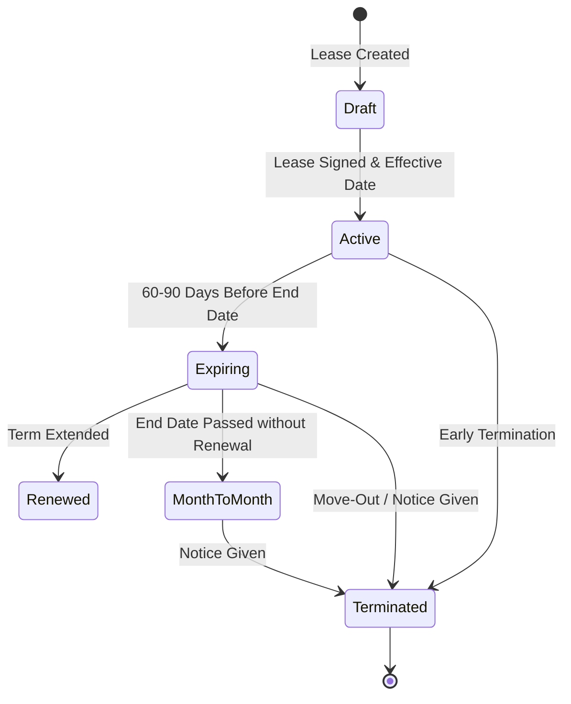

# Leases Module

The **Leases** module (`modules/leases/`) manages the residential contract lifecycle, financial terms, deposit liabilities, and multi-tenant signatory assignments.

---

## 1. Lease Lifecycle & State Machine

### Supported Statuses

* `draft`: Prepared agreement awaiting execution
* `active`: Currently in effect
* `expiring`: Reaching the end of the contractual term
* `renewed`: Superseded by renewal agreement
* `month_to_month`: Holding over post-lease term
* `terminated`: Finalized tenancy; ready for deposit disposition

---

## 2. Multi-Party Signatories (`lease_contacts`)

Residential tenancies frequently involve multiple roommates, co-signers, and non-financially responsible dependents:

* `primary_tenant`: Primary billing contact and occupant
* `co_tenant`: Co-signing resident with joint liability
* `guarantor`: Non-occupant financial guarantor
* `occupant`: Minor child or dependent without financial liability (`is_financially_responsible = 0`)

---

## 3. Financial Terms & Security Deposits

* `rent_amount_cents` (INTEGER cents): Contracted monthly recurring rent.
* `security_deposit_cents` (INTEGER cents): Total agreed deposit required.
* `deposit_held_cents` (INTEGER cents): Total cash deposit currently collected into trust.
* `rent_due_day` (INTEGER): Day of month rent is due (defaults to `1`).
* `late_fee_grace_days` (INTEGER): Grace period days before late fees apply (defaults to `5`).
* `late_fee_amount_cents` (INTEGER cents): Flat late charge applied when delinquent.
* `notice_date` (INTEGER ms): Epoch timestamp when formal notice of termination was delivered.
* `move_out_date` (INTEGER ms): Epoch timestamp when resident surrendered physical possession.

---

## 4. Lease Renewal & Move-Out Termination Workflows

* **Lease Renewal Modal**: Operators can execute a formal lease renewal (`renew_lease` action) specifying a validated expiration date and revised monthly rent. The action updates status to `active` or records renewal details while maintaining full audit trail.
* **Move-Out & Termination Modal**: Tenancy conclusion (`terminate_lease` action) captures and persists formal notice dates (`notice_date`) and scheduled move-out dates (`move_out_date`). It transitions the lease to `terminated`, automatically flags the unit for turnover inspection, and prepares the statutory security deposit disposition workflow to reconcile deposit refunds or deductions against the tenant ledger within legal jurisdiction deadlines.

---

## 5. API Endpoints

* `GET /api/v1/leases`: List leases with status, unit, and contact filters
* `POST /api/v1/leases`: Create a new lease with signatories
* `GET /api/v1/leases/:id`: Get full lease details, signatories, terms, and current ledger balance
* `PUT /api/v1/leases/:id`: Update lease terms or status
* `POST /api/v1/leases/:id/renew`: Execute lease extension/renewal
* `POST /api/v1/leases/:id/terminate`: Terminate lease contract (accepts optional `notice_date` and `move_out_date` epoch ms)
* `POST /api/v1/leases/:id/signatories`: Add signatory to lease
* `DELETE /api/v1/leases/:id/contacts/:contact_id`: Remove signatory from lease
* `GET /api/v1/leases/:id/recurring_charges`: List active recurring charge line items
* `POST /api/v1/leases/:id/recurring_charges`: Add recurring fee schedule (pet rent, parking, utility)
* `DELETE /api/v1/leases/:id/recurring_charges/:charge_id`: Soft delete recurring fee schedule
* `GET /api/v1/leases/:id/credits`: List tenant credits, concessions, and discounts
* `POST /api/v1/leases/:id/credits`: Post promotional concession or ledger adjustment
* `GET /api/v1/leases/late_fee_policies`: List configurable late fee policies across properties
* `POST /api/v1/leases/late_fee_policies`: Create configurable late fee policy (flat, percent balance, or percent rent)
* `GET /api/v1/leases/:id/late_fee_policy`: Retrieve active late fee policy assigned to a lease or its property
* `POST /api/v1/leases/:id/calculate_late_fee`: Calculate potential late fee against current double-entry AR balance
* `POST /api/v1/leases/:id/apply_late_fee`: Apply assessed late fee to tenant ledger and double-entry GL
* `GET /api/v1/leases/:id/deposit_refunds`: List security deposit refunds issued for a lease
* `POST /api/v1/leases/:id/deposit_refunds`: Issue security deposit refund with check/payment reference
* `GET /api/v1/leases/:id/clauses`: List custom lease clauses and legal covenants
* `POST /api/v1/leases/:id/clauses`: Attach custom lease clause
* `PUT /api/v1/leases/:id/clauses/:clause_id`: Update clause title, text, or display order
* `DELETE /api/v1/leases/:id/clauses/:clause_id`: Delete custom lease clause

---

## 6. Recurring Lease Charges, Credits & Concessions

### 6.1. Recurring Charges

In addition to baseline monthly rent, leases support recurring charge schedules (e.g. pet rent, reserved parking space, storage unit, trash surcharge). Recurring charges specify:
- `charge_category`: `base_rent`, `pet_rent`, `parking_fee`, `storage_fee`, `utility_surcharge`, or `amenity_fee`.
- `amount_cents`: Integer cents due per cycle.
- `gl_account_id`: Chart of Accounts revenue account to credit upon billing generation.
- `billing_frequency`: `monthly`, `quarterly`, `annually`, or `one_time`.

### 6.2. Concessions & Adjustments

Tenant ledger balance adjustments fall into four audited categories:
- `promotional_concession`: Move-in discount or marketing concession.
- `maintenance_inconvenience`: Courtesy credit granted during repairs.
- `discretionary_credit`: Manager adjustment for administrative reasons.
- `bad_debt_writeoff`: Uncollectible debt write-off upon tenancy termination.

---

## 7. Custom Lease Clauses & Legal Addenda

Lease documents support modular clauses and legal addenda (`lease_clauses`). Clauses can be marked `is_mandatory` and arranged via `sort_order`. They capture specific tenant restrictions (e.g., quiet hours, parking rules, lead paint disclosures, mold addenda) that are rendered in printed lease agreements and the tenant portal.

---

## 8. Late Fee Policies & Statutory Compliance

Late fee policies define:
- `grace_period_days`: Days elapsed after due date before delinquent calculation triggers.
- `calculation_type`: `flat_fee`, `percentage_of_delinquency`, or `daily_accrual`.
- `statutory_cap_cents`: Maximum legal fee limit governed by municipal or state statutes.
- `delinquency_threshold_cents`: Minimum overdue balance required before a late fee is levied.

---

## 9. Commercial Common Area Maintenance (CAM) & Expense Recoveries

For commercial and mixed-use tenancies, the `expense_recovery_charges` table defines pro-rata pass-through allocations for Common Area Maintenance (CAM), building insurance, and property taxes based on square footage shares (`share_percentage_bps`) or fixed formulas, reconciled on an annual basis.
