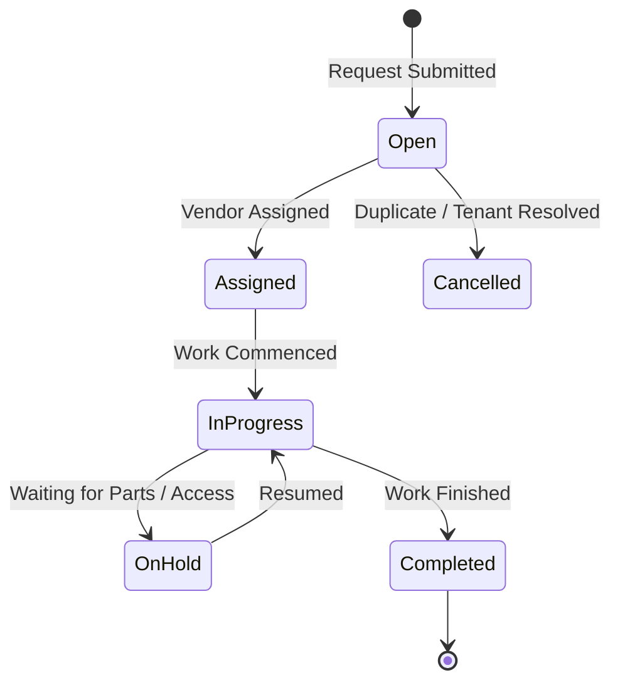

# Maintenance Module

The **Maintenance** module (`modules/maintenance/`) coordinates repair requests, vendor dispatching, priority triage, and work order lifecycle tracking.

---

## 1. Work Order Lifecycle (`work_orders`)

---

## 2. Priority & Category Matrices

### Priority Levels

* `low`: Cosmetic or non-urgent repairs (e.g., paint touch-up)
* `medium`: Standard maintenance issues (e.g., sticking door lock, running toilet)
* `high`: Functional disruption affecting tenancy (e.g., oven broken, hot water out)
* `emergency`: Urgent threat to habitability or property safety (e.g., burst pipe, gas leak, HVAC failure in winter)

### Category Types

* `plumbing`
* `electrical`
* `hvac`
* `appliance`
* `structural`
* `cosmetic`
* `pest`
* `make_ready` (Unit turnover inspections & turnover remediation)
* `other`

---

## 3. Vendor Dispatch Workflow

The maintenance module integrates with the **Contacts** vendor registry:

* **Trade-Filtered Dispatching**: When dispatching a work order, operators select exclusively from vendors verified for the relevant trade (e.g. plumbing, HVAC, electrical, make-ready, or general contracting).
* **Compliance Safeguard**: Only vendors with verified W-9 status (`w9_received = 1`) are eligible for dispatch. The repository and API enforce this invariant, rejecting assignment of unverified contractors or mismatched trade specialties.
* **Status Automation & Guardrails**: Dispatching transitions tickets to `assigned` / `in_progress`. Dispatching is restricted to dispatchable statuses (`open`, `assigned`, `on_hold`) and strictly prohibited on completed or cancelled work orders.

---

## 4. Cross-Module Expense Integration

When a work order status transitions to `completed` and contains an `actual_cost_cents > 0`, the maintenance module publishes a `work_order.completed` event to the central `EventBus`.

The **Accounting** module listens for this event and can automatically record a matching `expense` transaction categorized under Schedule E `repairs` or `supplies`.

---

## 5. API Endpoints

* `GET /api/v1/maintenance`: List work orders with filter by status, priority, property, and vendor
* `POST /api/v1/maintenance`: Submit a new work order
* `GET /api/v1/maintenance/:id`: Fetch work order details and vendor contact card
* `PUT /api/v1/maintenance/:id`: Update status, priority, entry instructions, and actual cost
* `PUT /api/v1/maintenance/:id/close`: Complete work order workflow with resolution summary and vendor invoice link
* `GET /api/v1/maintenance/:id/tasks`: List subtask checklist items
* `POST /api/v1/maintenance/:id/tasks`: Create subtask checklist item
* `PUT /api/v1/maintenance/:id/tasks/:task_id`: Mark subtask complete or update assignment
* `DELETE /api/v1/maintenance/:id`: Soft delete work order

---

## 6. Work Order Task Checklists, Closure & Technician Timecards

### 6.1. Subtask Checklists

Work orders support multi-step task checklists (`work_order_tasks`). Maintenance supervisors assign subtasks to specific staff members or contractors with individual due dates. A work order cannot be closed if mandatory subtasks remain incomplete.

### 6.2. Formal Closure Workflow

Closing a work order (`PUT /api/v1/maintenance/:id/close`) requires capturing:
- `completed_at`: Verification timestamp (epoch ms).
- `completion_notes`: Documented repair outcome and tenant sign-off.
- `actual_cost_cents`: Total labor and material expense.
- Optional link to an Accounts Payable bill (`bills.id`) for vendor invoicing.

### 6.3. Technician Timecard Integration (Sprint 6: Field Operations)

Technicians log billable hours against work orders (`technician_timecards`). Logged hours aggregate with hourly labor rates (`hourly_rate_cents`) to compute total labor expenses, which can be automatically converted into AP bills for contractor disbursement.
