# GarrisonOS UI Visual Tour & Screen Reference

This document provides a visual tour of the GarrisonOS native TypeScript Server-Side Rendered (SSR) presentation layer. All screenshots were captured on **October 2, 2026** against a running local instance with a realistic 50-unit seeded demo portfolio.

---

## Table of Contents

1. [Authentication & Dashboard](#1-authentication--dashboard)
2. [Universal Search Engine](#2-universal-search-engine)
3. [Properties & Portfolios](#3-properties--portfolios)
4. [Lease Agreements & AR Subsystem](#4-lease-agreements--ar-subsystem)
5. [Contacts Directory](#5-contacts-directory)
6. [Maintenance & Work Orders](#6-maintenance--work-orders)
7. [Accounting, Ledger & AP Subsystem](#7-accounting-ledger--ap-subsystem)
8. [Tax Reports & Accounting Integrations](#8-tax-reports--accounting-integrations)
9. [Platform Administration & Governance](#9-platform-administration--governance)

---

## 1. Authentication & Dashboard

### 1.1 Sign-In Page
* **Path**: `/login`
* **Artifact**: `docs/assets/screenshots/2026-10-02_01_login_page.png`
* **Features**: Standalone authentication card with brand identity, secure HMAC session token delivery, CSRF protection, and optional multi-tenant operator specification.

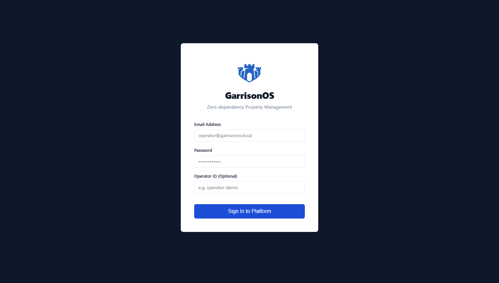

---

### 1.2 Executive Portfolio Dashboard (Overview Mode)
* **Path**: `/`
* **Artifact**: `docs/assets/screenshots/2026-10-02_02_dashboard.png`
* **Features**: Live portfolio overview with portfolio/property selector bar, view mode presets (`Overview`, `Occupancy`, `Financial`, `Maintenance`), headline KPI cards, native SVG Donut Charts for Bedroom Occupancy and Rent Collection vs Delinquency, and compact 5-row side-by-side recent activity registers.

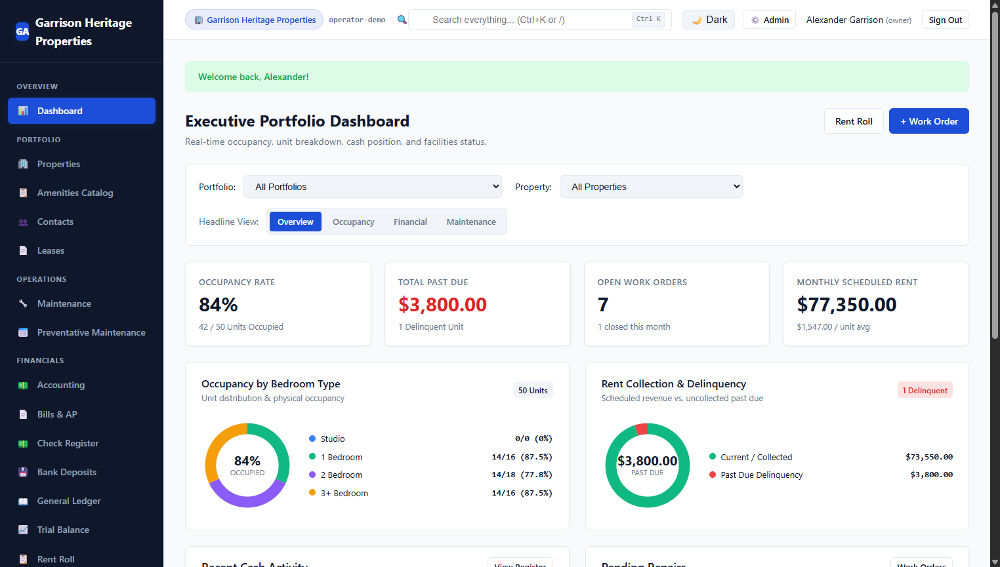

---

### 1.3 Executive Portfolio Dashboard (Occupancy Focus Mode)
* **Path**: `/?focus=occupancy`
* **Artifact**: `docs/assets/screenshots/2026-10-02_02b_dashboard_occupancy_focus.png`
* **Features**: Dynamic headline cards recalculating physical occupancy percentage and unit breakdown per bedroom type (Studio, 1-Bed, 2-Bed, 3+ Bed) scoped to the portfolio or property.

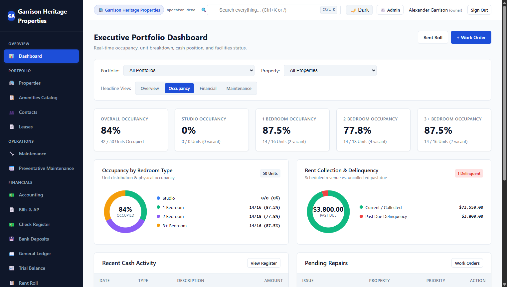

---

### 1.4 Universal Entity Summary Preview Modal
* **Trigger**: Click any entity link, badge, or record row across the main view
* **Artifact**: `docs/assets/screenshots/2026-10-02_02c_entity_preview_modal.png`
* **Features**: Dynamic summary dialog fetching high-level metadata (status badges, parent property, contact details, financial amounts), preventing loss of navigation context, with an "Open Full View ↗" action that seamlessly closes the modal and navigates directly to the dedicated detail view.

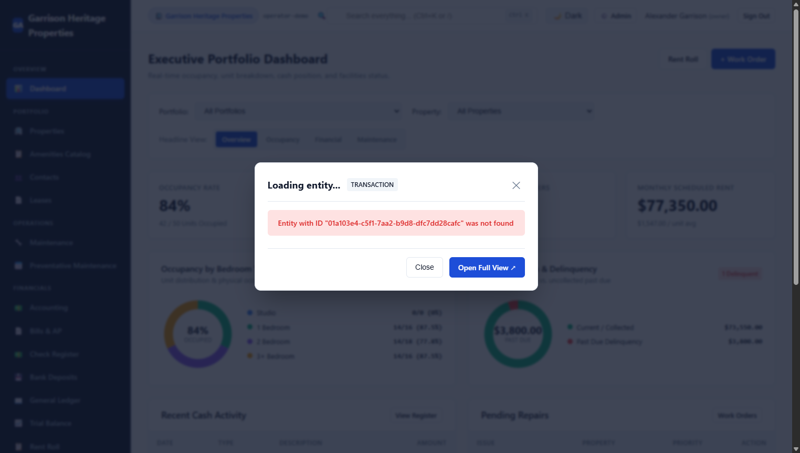

---

## 2. Universal Search Engine

### 2.1 Live Type-Ahead Quick Search Dropdown
* **Trigger**: Topbar search input (`Ctrl+K` or `/` hotkey)
* **Artifact**: `docs/assets/screenshots/2026-10-02_03_universal_search_dropdown.png`
* **Features**: High-speed, in-memory live index queries updating as the operator types. Displays top 3 matches grouped across Properties, Units, Leases, and Contacts with direct jump links.

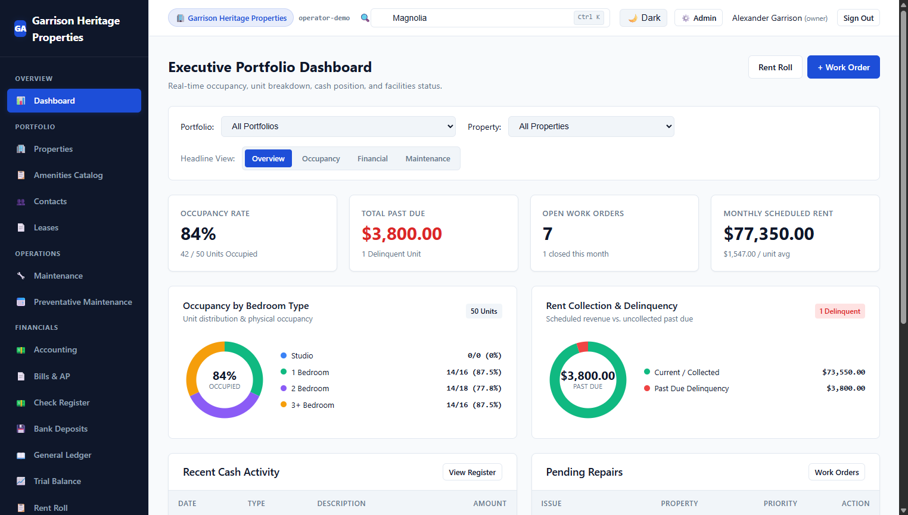

---

### 2.2 Universal Search Full Results Page
* **Path**: `/search?q=Magnolia`
* **Artifact**: `docs/assets/screenshots/2026-10-02_04_universal_search_full_results.png`
* **Features**: Comprehensive tabbed search results page with category filters ("All", "Properties", "Units", "Leases", "Contacts"), match relevance indicators, and automatic operator permission filtering.

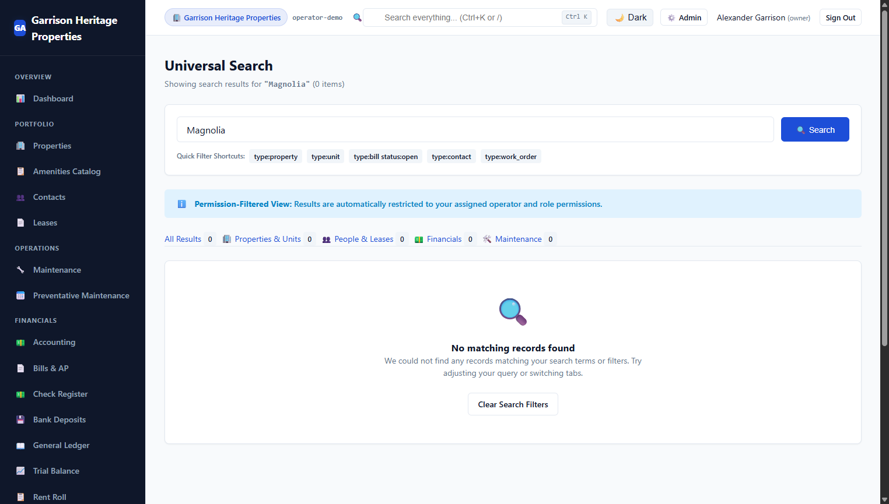

---

## 3. Properties & Portfolios

### 3.1 Properties Catalog
* **Path**: `/properties`
* **Artifact**: `docs/assets/screenshots/2026-10-02_05_properties_index.png`
* **Features**: Interactive catalog of managed real estate assets with portfolio filter dropdown, unit counts, occupancy status badges, semantic `data-entity` markup, copy-ID actions, and compact 10 items/page pagination controls.

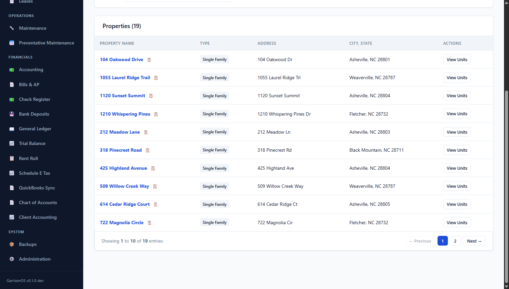

---

### 3.2 Property Detail & Unit Roster
* **Path**: `/properties/show?id=...`
* **Artifact**: `docs/assets/screenshots/2026-10-02_06_property_detail.png`
* **Features**: Detailed property profile with address, unit breakdown, dynamic custom fields, unit turnover initiation, vector marketing flyer generation, and direct access to marketing amenities.

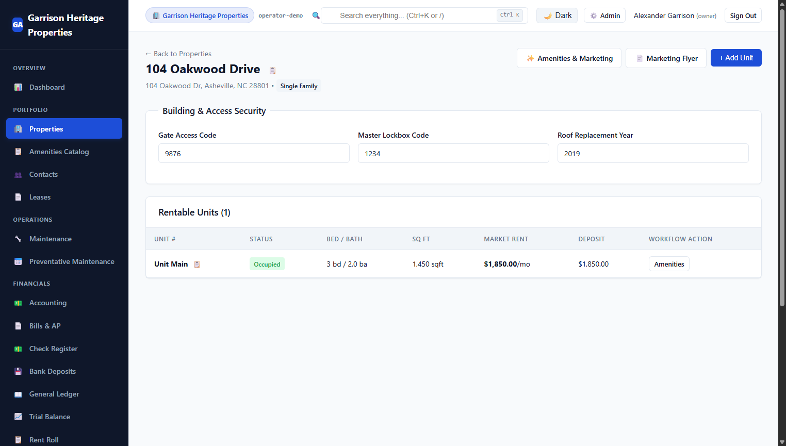

---

### 3.3 Marketing & Amenities Catalog
* **Path**: `/properties/amenities`
* **Artifact**: `docs/assets/screenshots/2026-10-02_07_amenities_catalog.png`
* **Features**: Amenity definition catalog and marketing feature manager supporting property-level and unit-level amenity assignment, fee overrides, and flyer presentation.

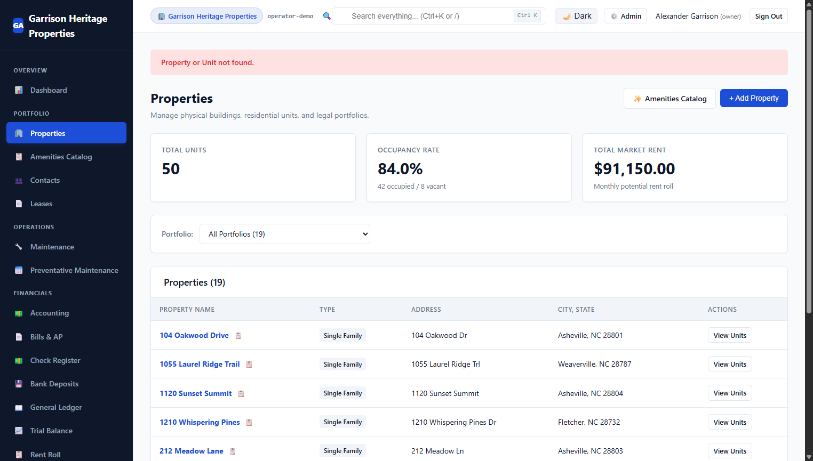

---

## 4. Lease Agreements & AR Subsystem

### 4.1 Leases Directory
* **Path**: `/leases`
* **Artifact**: `docs/assets/screenshots/2026-10-02_08_leases_index.png`
* **Features**: Filterable table of lease contracts with property filter dropdown, status filter pills (All, Active, Month-to-Month, Draft, Terminated), terms, monthly rent, deposit balances, and 10 items/page pagination.

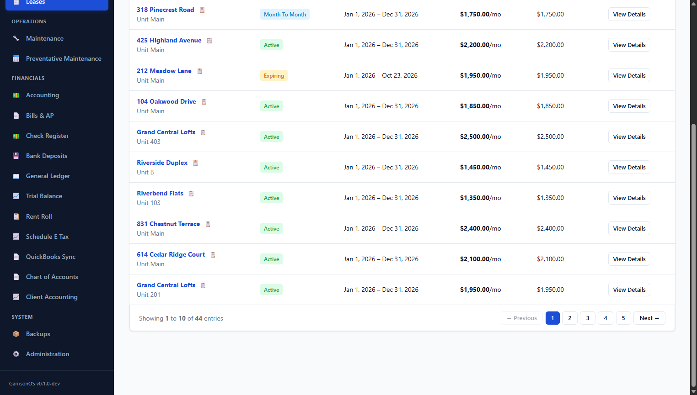

---

### 4.2 Lease Record & Tenant AR Subsystem
* **Path**: `/leases/show?id=...`
* **Artifact**: `docs/assets/screenshots/2026-10-02_09_lease_detail.png`
* **Features**: Complete lease lifecycle view with signatory occupant directory, financial terms, dynamic custom fields, conversation history, and AR controls (credit concessions, late fees, security deposit refunds).

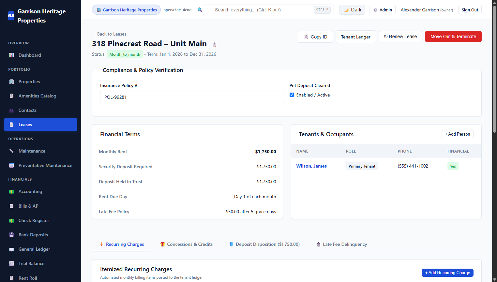

---

## 5. Contacts Directory

### 5.1 Contacts Directory
* **Path**: `/contacts`
* **Artifact**: `docs/assets/screenshots/2026-10-02_10_contacts_directory.png`
* **Features**: Unified contact directory with contact type filter pills (All, Tenants, Owners, Vendors, Prospects), text search, 1099 tax classification indicators, and 10 items/page pagination.

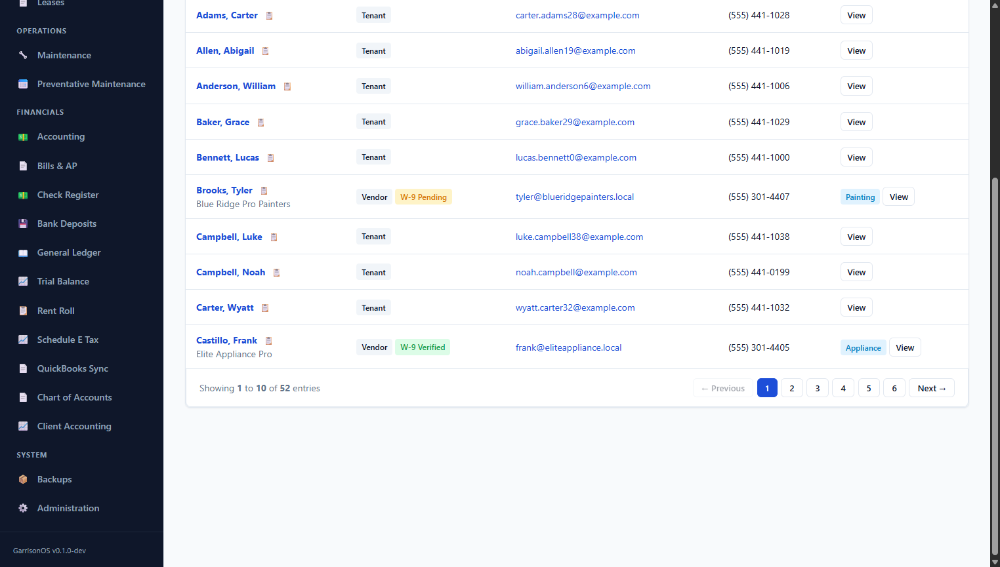

---

### 5.2 Contact Detail View
* **Path**: `/contacts/show?id=...`
* **Artifact**: `docs/assets/screenshots/2026-10-02_11_contact_detail.png`
* **Features**: Contact record view with primary/secondary phone, email, notes, tax ID status, dynamic custom fields, and quick-copy UUIDv7 action.

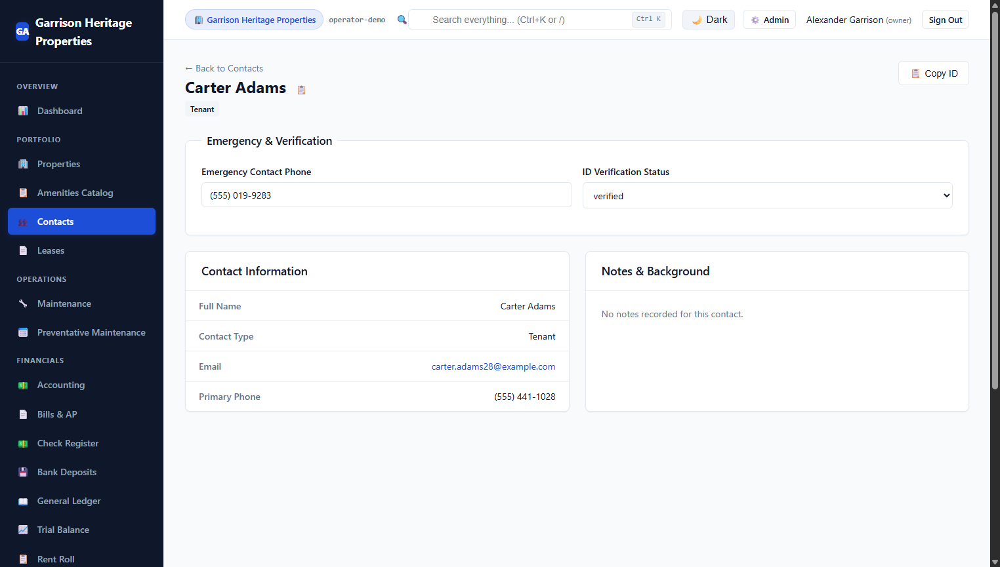

---

## 6. Maintenance & Work Orders

### 6.1 Work Orders Queue
* **Path**: `/maintenance`
* **Artifact**: `docs/assets/screenshots/2026-10-02_12_maintenance_work_orders.png`
* **Features**: Maintenance ticket list with property filter dropdown, status filter pills, priority badges (Low, Medium, High, Emergency), trade category filters, make-ready turnover workflows, and 10 items/page pagination.

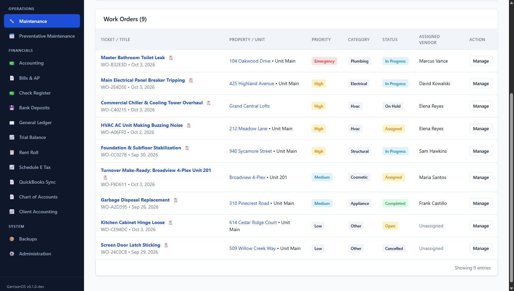

---

### 6.2 Work Order Detail, Multi-Vendor & Budget Tracking
* **Path**: `/maintenance/show?id=...`
* **Artifact**: `docs/assets/screenshots/2026-10-02_13_maintenance_detail.png`
* **Features**: In-depth work order record featuring primary and secondary contractor assignments (`work_order_vendors`), live Budget & Expense Tracking with linked AP bills, budget variance calculations, over-budget alert badge, and chronological conversation timeline with field technician notes and status updates.

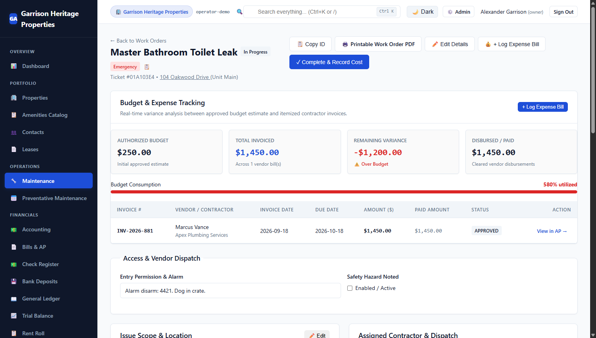

---

### 6.2b Auto-Held Work Order (Spend Threshold Policy Guardrail)
* **Path**: `/maintenance/show?id=...`
* **Artifact**: `docs/assets/screenshots/2026-10-02_13b_maintenance_detail_on_hold.png`
* **Features**: Prominent automated amber hold alert banner triggered when estimated expenses exceed portfolio spend thresholds (e.g. $8,500.00 estimate exceeding the $5,000.00 Downtown Lofts portfolio threshold) or available operating funds. Displays policy rationale, multiple assigned trade specialists, and automated audit notices.

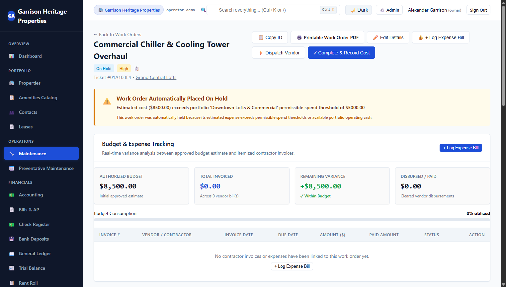

---

### 6.3 Preventative Maintenance Engine
* **Path**: `/maintenance/preventative`
* **Artifact**: `docs/assets/screenshots/2026-10-02_14_preventative_maintenance.png`
* **Features**: Preventative maintenance schedule manager with property filter dropdown, recurring frequencies (Monthly, Quarterly, Semi-Annual, Annual), trigger lead-times, automated work order generation, and 10 items/page pagination.

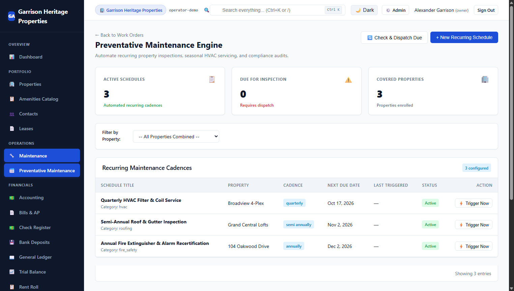

---

## 7. Accounting, Ledger & AP Subsystem

### 7.1 Financial Accounting Overview
* **Path**: `/accounting`
* **Artifact**: `docs/assets/screenshots/2026-10-02_15_accounting_dashboard.png`
* **Features**: Cash flow overview cards, property filter dropdown, transaction type filter pills, running bank balances, manual transaction entry, and 15 items/page pagination.

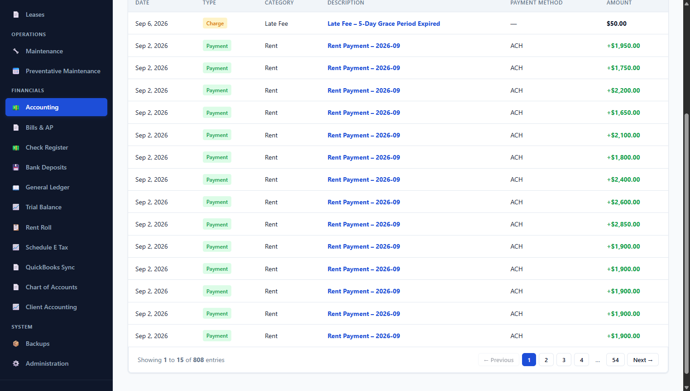

---

### 7.2 Accounts Payable Bills Queue
* **Path**: `/accounting/bills`
* **Artifact**: `docs/assets/screenshots/2026-10-02_16_bills_payable_queue.png`
* **Features**: AP invoice queue with property filter dropdown, status filter pills (All, Draft, Approved, Paid, Overdue), SVG status distribution pie chart, 30-day projected cash outflow bar chart, bill approval/void controls, and 10 items/page pagination.

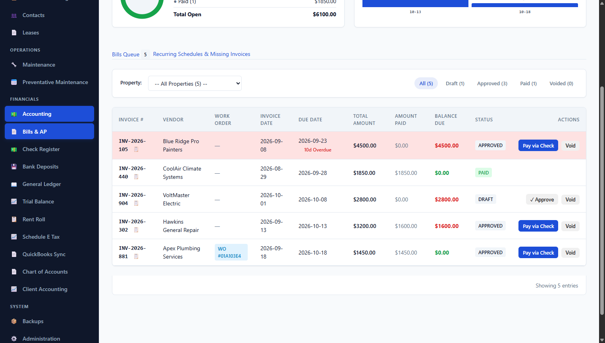

---

### 7.3 Multi-Property Bill Allocation Modal
* **Trigger**: Click `+ Enter New Bill` on `/accounting/bills`
* **Artifact**: `docs/assets/screenshots/2026-10-02_17_bill_creation_modal.png`
* **Features**: Interactive bill creation dialog supporting multi-row dynamic expense allocation splits across multiple properties, units, and expense accounts with 100% opaque surface styling.

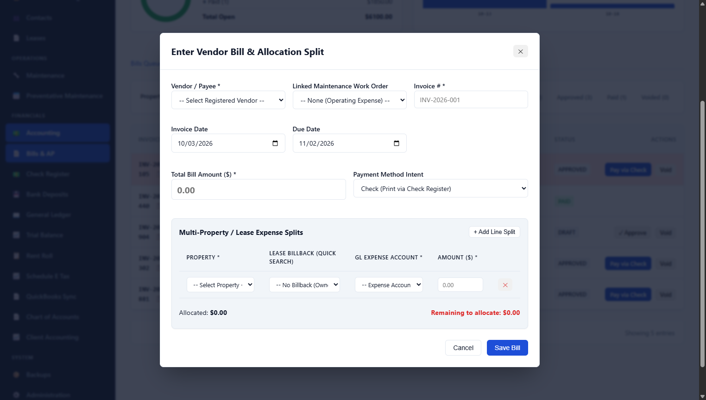

---

### 7.3b Dark Mode Modal & High-Contrast Form Controls
* **Trigger**: Toggled dark mode on modal dialogs
* **Artifact**: `docs/assets/screenshots/2026-10-02_17b_bill_creation_modal_dark.png`
* **Features**: Complete dark mode contrast and styling enforcement across all `<dialog>` modals, `.modal`, and form controls (`.form-control`, `.form-input`). Eliminates browser default transparent backgrounds and unreadable dark text on dark surfaces with fully opaque `var(--bg-surface)` backgrounds, high-contrast typography, and backdrop blur.

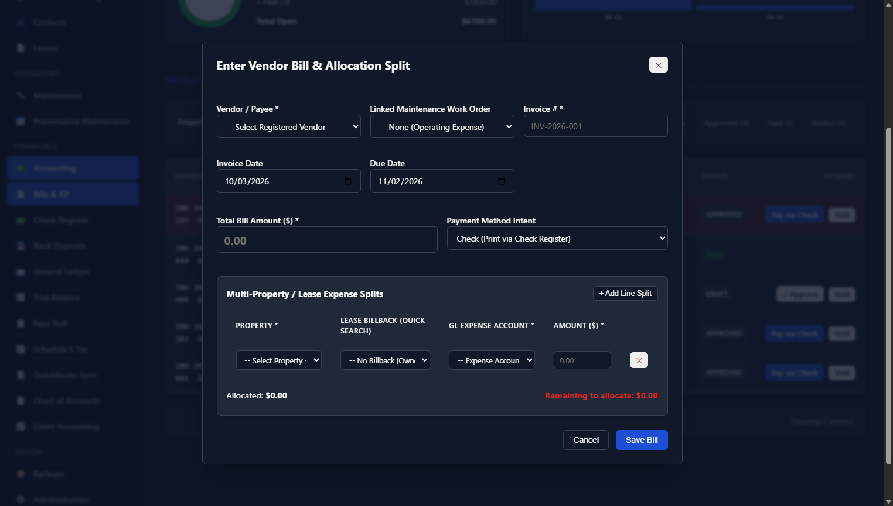

---

### 7.4 Check Register & PDF Batch Preview
* **Path**: `/accounting/checks`
* **Artifact**: `docs/assets/screenshots/2026-10-02_18_check_register.png`
* **Features**: Physical check disbursement register tracking check numbers, bank account filter dropdown, status filter pills (All, Draft, Printed, Cleared, Voided), batch PDF check printing preview, and 10 items/page pagination.

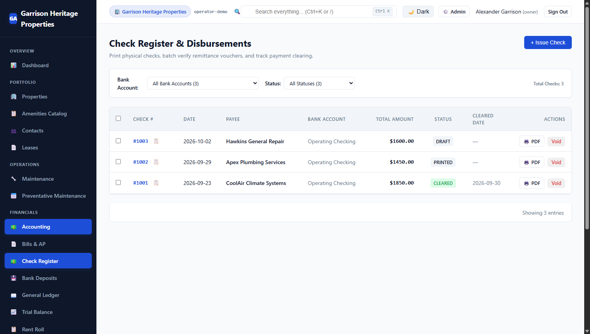

---

### 7.5 Check Issuance Modal
* **Trigger**: Click `+ Issue Check` on `/accounting/checks`
* **Artifact**: `docs/assets/screenshots/2026-10-02_18b_check_issuance_modal.png`
* **Features**: Check creation modal with auto-incrementing check numbering, operating bank account selection, vendor payee, memo, open bill allocation, and high-contrast styling.

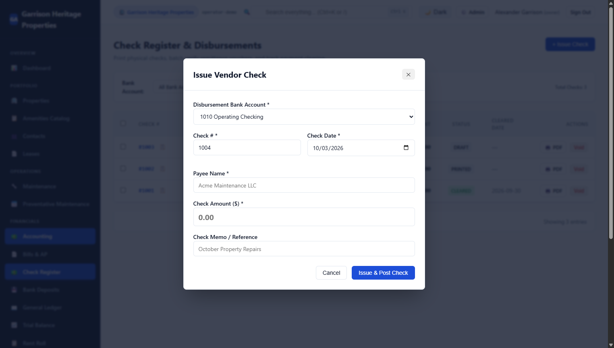

---

### 7.6 Bank Deposit Batching & Reconciliation
* **Path**: `/accounting/deposits`
* **Artifact**: `docs/assets/screenshots/2026-10-02_19_bank_deposits.png`
* **Features**: Undeposited funds batching queue (GL 1030) displaying unbatched tenant receipts ($3,850.00), live running total calculation, operating bank account selector, remitter PDF receipts, and Deposit History tab with 10 items/page pagination.

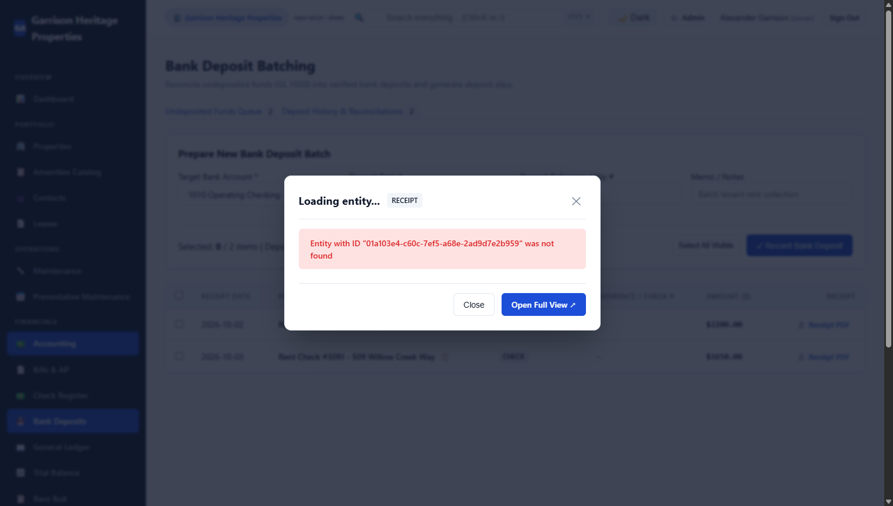

---

### 7.7 General Ledger Journal Entries
* **Path**: `/accounting/general-ledger`
* **Artifact**: `docs/assets/screenshots/2026-10-02_20_general_ledger.png`
* **Features**: Full double-entry general ledger with balanced debits and credits, source document tracking, reversing entries, and date-range filters.

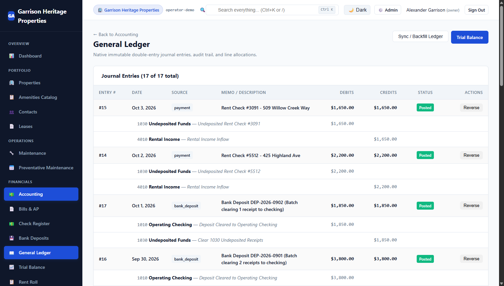

---

### 7.8 Trial Balance Report
* **Path**: `/accounting/trial-balance`
* **Artifact**: `docs/assets/screenshots/2026-10-02_21_trial_balance.png`
* **Features**: Standard accounting trial balance report categorizing Asset, Liability, Equity, Income, and Expense accounts, validating zero net discrepancy.

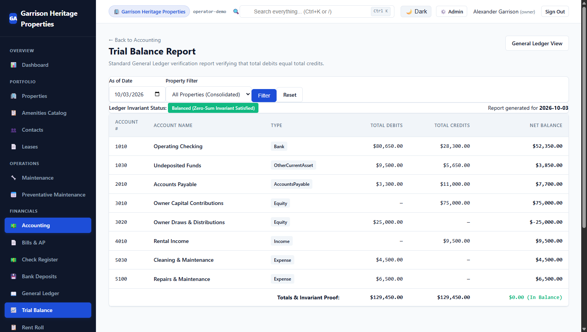

---

## 8. Tax Reports & Accounting Integrations

### 8.1 Portfolio Rent Roll
* **Path**: `/accounting/rent-roll`
* **Artifact**: `docs/assets/screenshots/2026-10-02_22_rent_roll.png`
* **Features**: Unit-by-unit rent roll report with property filter dropdown, dynamic summary metric cards (units, monthly rent, deposits held, open balance) recalculating per property, CSV export, and 10 units/page pagination.

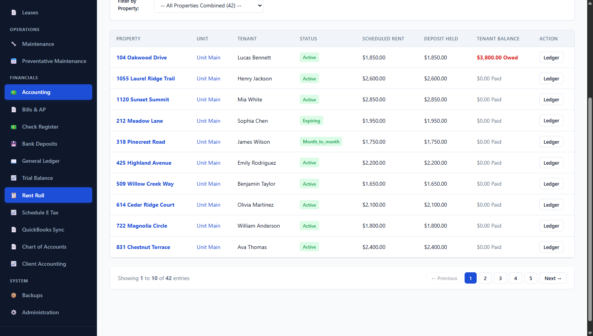

---

### 8.2 IRS Schedule E Supplemental Tax Report
* **Path**: `/accounting/schedule-e`
* **Artifact**: `docs/assets/screenshots/2026-10-02_23_schedule_e.png`
* **Features**: Tax year income and expense breakdown matching IRS Form 1040 Schedule E line items (Rents received, Advertising, Auto & travel, Cleaning & maintenance, Insurance, Legal & professional fees, Taxes, Utilities), calculating total Net Operating Income (NOI).

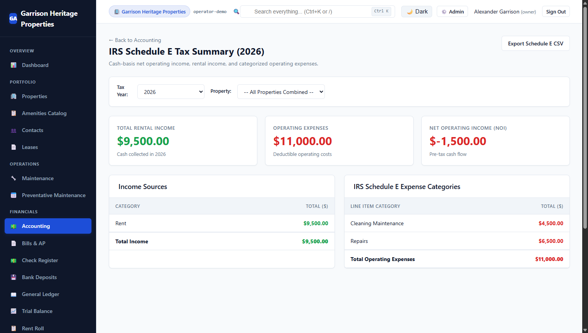

---

### 8.3 QuickBooks Desktop IIF & QBO Sync
* **Path**: `/accounting/quickbooks`
* **Artifact**: `docs/assets/screenshots/2026-10-02_24_quickbooks_sync.png`
* **Features**: Accounting synchronization hub offering one-click downloads for QuickBooks Desktop IIF, QBO Journal Entry CSV, and Web Connect OFX/QBO files, alongside past sync logs.

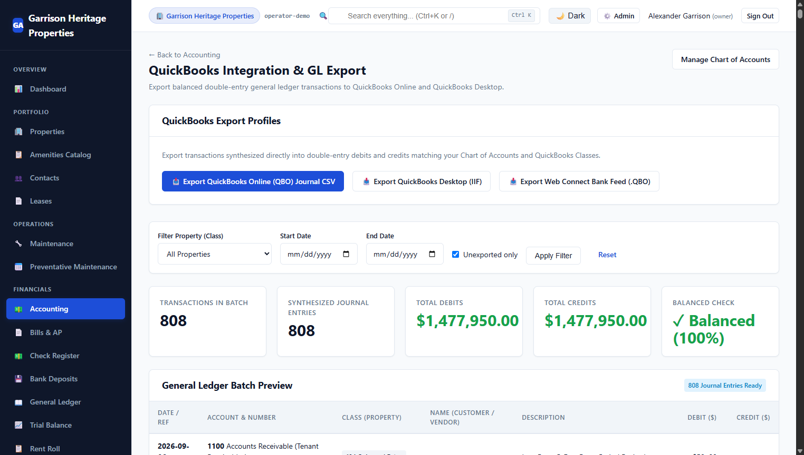

---

### 8.4 Client Accounting & Owner Ledgers
* **Path**: `/accounting/client-accounting`
* **Artifact**: `docs/assets/screenshots/2026-10-02_25_client_accounting.png`
* **Features**: Property management client accounting engine tracking owner capital contributions, monthly owner distributions, and automated management fee agreements.

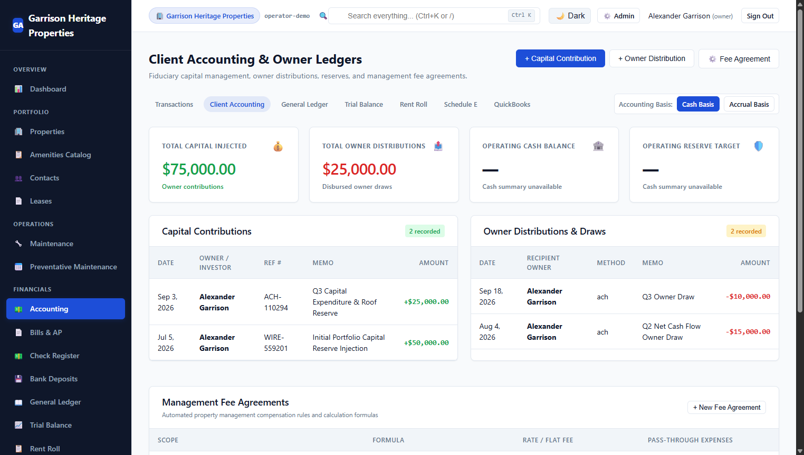

---

## 9. Platform Administration & Governance

### 9.1 Custom Fields Manager
* **Path**: `/admin?tab=custom_fields`
* **Artifact**: `docs/assets/screenshots/2026-10-02_26_admin_custom_fields.png`
* **Features**: No-code schema extension manager allowing operators to define typed custom fields and sections across 6 core entities (`property`, `unit`, `lease`, `contact`, `work_order`, `bill`).

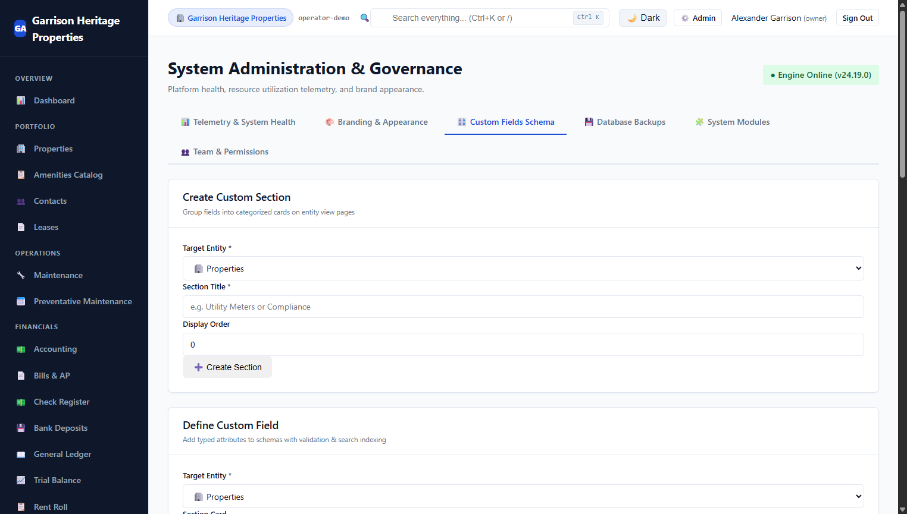

---

### 9.2 System Diagnostics & Server Health
* **Path**: `/admin?tab=system`
* **Artifact**: `docs/assets/screenshots/2026-10-02_27_admin_system_health.png`
* **Features**: Real-time Node.js runtime metrics (Uptime, Memory RSS / Heap, Platform), SQLite database file sizing, WAL journal statistics, and security environment status.

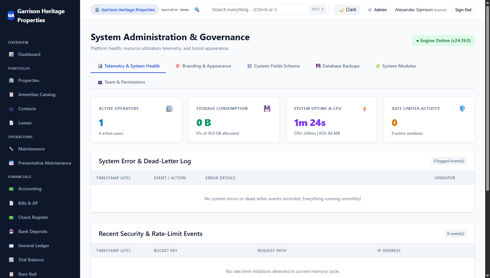

---

### 9.3 Database Backup & Restore Manager
* **Path**: `/admin?tab=backups`
* **Artifact**: `docs/assets/screenshots/2026-10-02_28_admin_backups.png`
* **Features**: Point-in-time database snapshot tool with automated retention policies, cryptographic SHA-256 integrity verification, instant downloads, and fail-closed restore workflows without tab bar scrollbars.

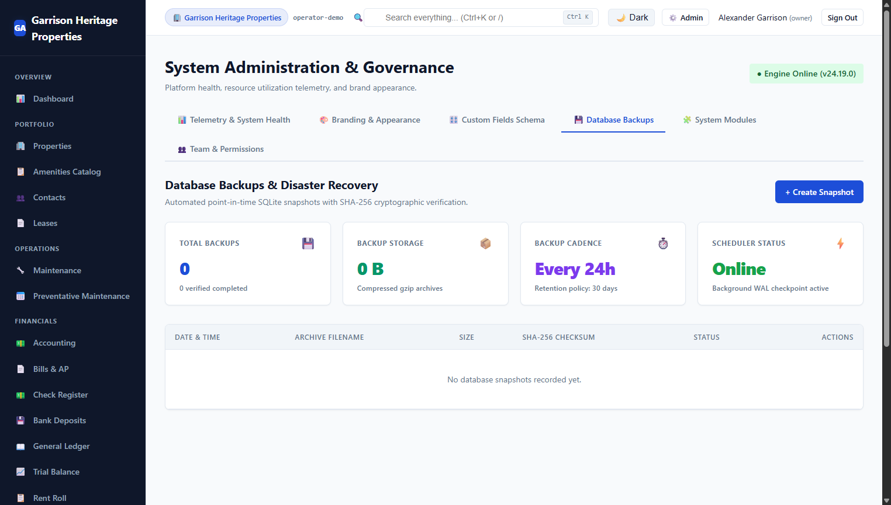

---

### 9.4 User Management, Roles & Granular Permissions
* **Path**: `/admin?tab=users`
* **Artifact**: `docs/assets/screenshots/2026-10-02_29_admin_users_and_permissions.png`
* **Features**: Centralized user governance dashboard for creating, editing, and deactivating team members. Supports role assignment (`admin`, `property_manager`, `leasing_agent`, `maintenance`, `auditor`), portfolio scoping, and granular per-module permission toggles (Properties, Leases, Maintenance, Accounting, Contacts).

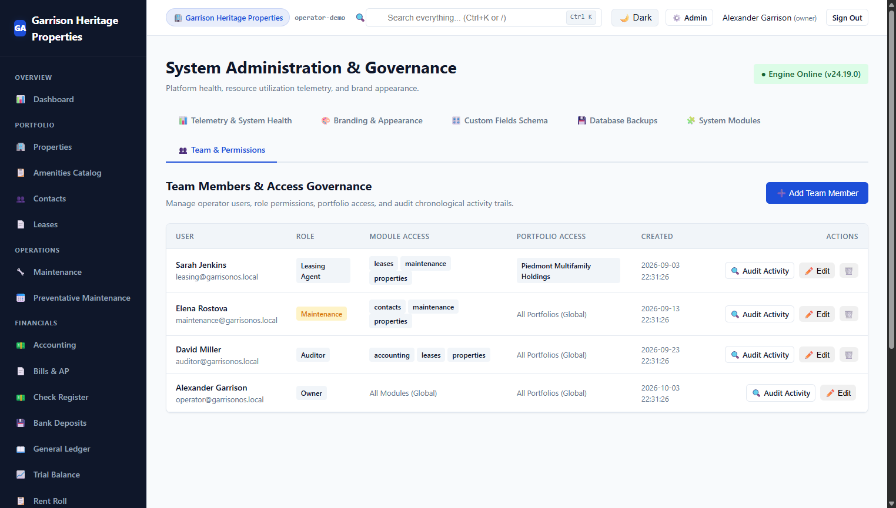

---

### 9.5 User Activity Audit Trail
* **Path**: `/admin?tab=users&audit_user_id=...`
* **Artifact**: `docs/assets/screenshots/2026-10-02_30_admin_user_activity_audit.png`
* **Features**: Immutable, chronological audit log inspection for individual users. Tracks action types (user creation, permission updates, work order dispatches, lease updates, banking reconciliations), client IP addresses, entity target IDs, human-readable summaries, and expandable JSON metadata payloads.

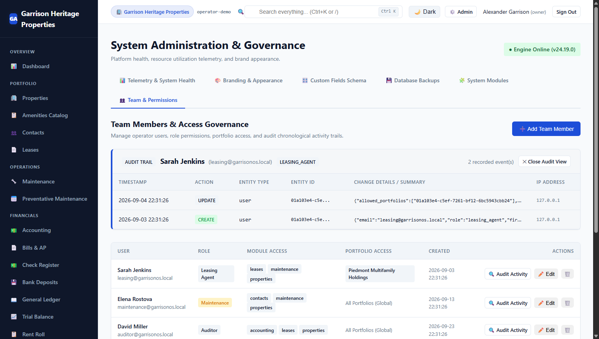

---

### 9.6 Loaded System Modules & Domain Extensions
* **Path**: `/admin?tab=modules`
* **Artifact**: `docs/assets/screenshots/2026-10-02_31_admin_modules.png`
* **Features**: Complete visual overview of all active domain modules, semantic versions, extension slots, and inter-module dependencies.

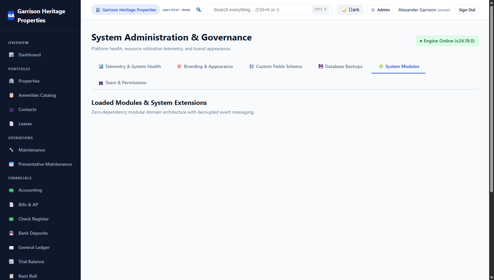

